# Class 7: Machine Learning 1
Alexia (PID: A17297003)

- [Background](#background)
- [K-means clustering](#k-means-clustering)
- [Hierarchical Clustering](#hierarchical-clustering)
- [Hands on with Principal Component Analysis
  (PCA)](#hands-on-with-principal-component-analysis-pca)
  - [Analysis of UK food data](#analysis-of-uk-food-data)
- [Data Import](#data-import)
- [Tidy data](#tidy-data)
- [Exploratory Analysis](#exploratory-analysis)
- [Digging Deeper (variable
  loadings)](#digging-deeper-variable-loadings)

## Background

Today we will explore some core machine learning methods that are very
popular in bioinformatics. These include **clustering** and
**dimensionallity reduction**

## K-means clustering

The main function in “base” R for K-means clustering is called
`kmeans()`

Before we go too deep let’s make up some “simple” data that we can
cluster and know if we are getting a good answer or not. To help us do
this we can use the `rnorm()` function

``` r
x <- c( rnorm(30, -3), rnorm(30, +3) )
z <- cbind(x=x, y=rev(x))
plot(z)
```

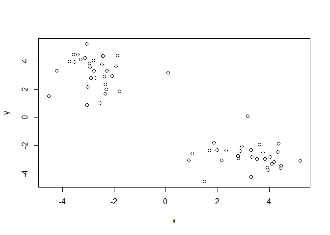

Now we can run `kmeans()` on this input `z` and see what the results
look like.

``` r
km <- kmeans(z, centers = 2)
km
```

    K-means clustering with 2 clusters of sizes 30, 30

    Cluster means:
              x         y
    1 -2.743848  3.188182
    2  3.188182 -2.743848

    Clustering vector:
     [1] 1 1 1 1 1 1 1 1 1 1 1 1 1 1 1 1 1 1 1 1 1 1 1 1 1 1 1 1 1 1 2 2 2 2 2 2 2 2
    [39] 2 2 2 2 2 2 2 2 2 2 2 2 2 2 2 2 2 2 2 2 2 2

    Within cluster sum of squares by cluster:
    [1] 55.94654 55.94654
     (between_SS / total_SS =  90.4 %)

    Available components:

    [1] "cluster"      "centers"      "totss"        "withinss"     "tot.withinss"
    [6] "betweenss"    "size"         "iter"         "ifault"      

``` r
attributes(km)
```

    $names
    [1] "cluster"      "centers"      "totss"        "withinss"     "tot.withinss"
    [6] "betweenss"    "size"         "iter"         "ifault"      

    $class
    [1] "kmeans"

> Q. How many points are in each cluster?

``` r
km$size
```

    [1] 30 30

> Q. What “component of your result object details cluster center?

``` r
km$cluster
```

     [1] 1 1 1 1 1 1 1 1 1 1 1 1 1 1 1 1 1 1 1 1 1 1 1 1 1 1 1 1 1 1 2 2 2 2 2 2 2 2
    [39] 2 2 2 2 2 2 2 2 2 2 2 2 2 2 2 2 2 2 2 2 2 2

> Q. Plot `z` colored by the kmeans cluster assignment and add cluster
> centers as blue points

``` r
plot(z, col = c("red", "blue"))
```

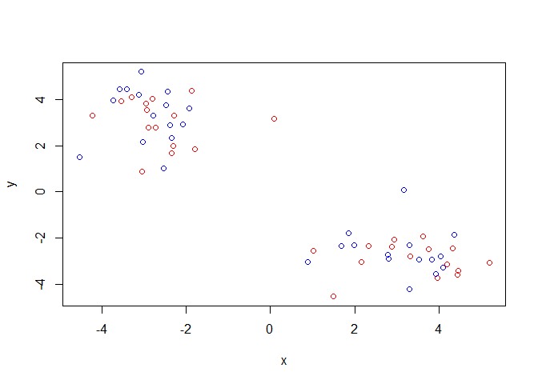

``` r
plot(z, col = km$cluster)
points(km$centers, col = "blue", pch = 15)
```

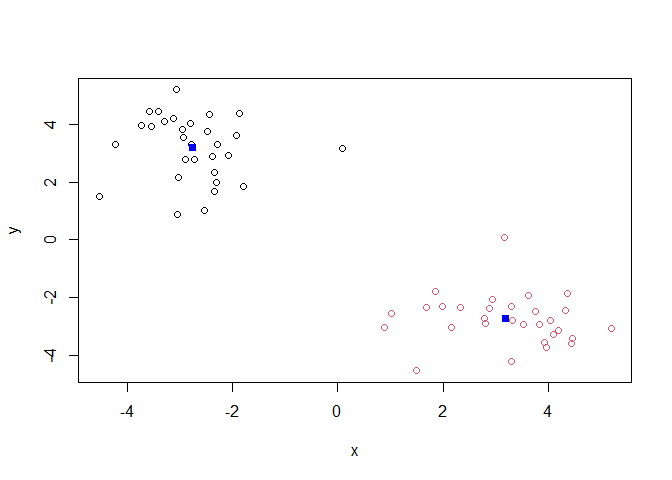

> Q. Run a K-means clustering and plot the results asking for 4 clusters
> (K = 4)?

``` r
km2 <- kmeans(z, centers = 4)
km2
```

    K-means clustering with 4 clusters of sizes 8, 13, 17, 22

    Cluster means:
              x         y
    1 -2.740127  1.679398
    2  2.154390 -2.453120
    3  3.978729 -2.966170
    4 -2.745201  3.736831

    Clustering vector:
     [1] 1 4 4 4 4 4 1 4 4 4 4 4 4 4 4 4 1 1 4 4 4 1 1 1 4 1 4 4 4 4 3 2 3 2 2 3 2 2
    [39] 2 2 3 3 2 2 2 3 3 3 3 3 3 3 2 2 3 3 3 3 3 2

    Within cluster sum of squares by cluster:
    [1]  6.721866 19.001800 10.487838 24.390744
     (between_SS / total_SS =  94.8 %)

    Available components:

    [1] "cluster"      "centers"      "totss"        "withinss"     "tot.withinss"
    [6] "betweenss"    "size"         "iter"         "ifault"      

``` r
km2 <- kmeans(z, centers = 4)
plot(z, col = km2$cluster)
points(km2$centers, col = "blue", pch = 15)
```

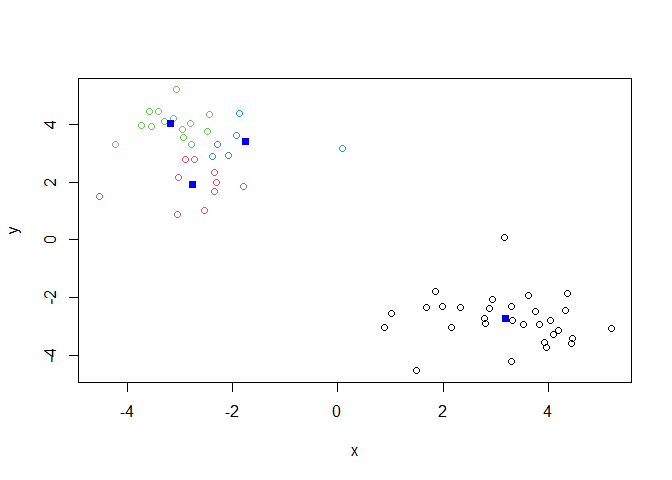

> **N.B** You need to tell K-means the number of clusters (i.e. set
> `centers = 2`)!!

One approach is to try different values for `centers` and then pick the
best…

``` r
ans <- NULL
for(i in 1:10) {
  km <- kmeans(z, centers = i)
  ans <- c(ans, km$tot.withinss)
}

plot(ans, typ = "o", 
     xlab = "Number of clusters", 
     ylab = "Total Sum of Squars Distance")
```

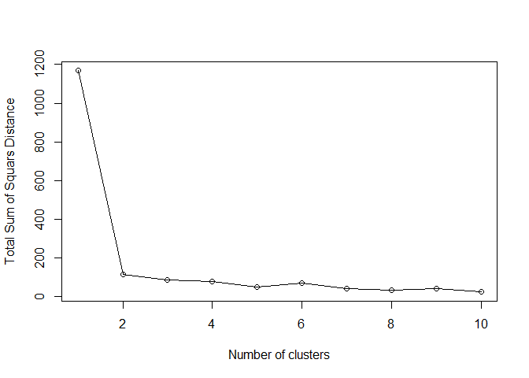

## Hierarchical Clustering

The main function in “base” R for Hierarchichal Clustering is called
`hclust()`

This function does not take “raw” data for clustering. You must first
build a “distance matrix” from your data and pass this as input to
`hclust`

``` r
d <- dist(z)
hc <- hclust(d)
hc
```


    Call:
    hclust(d = d)

    Cluster method   : complete 
    Distance         : euclidean 
    Number of objects: 60 

There is a bespoke `plot()` method for `hclust()` result objects.

``` r
plot(hc)
abline(h = 8, col = "red")
```

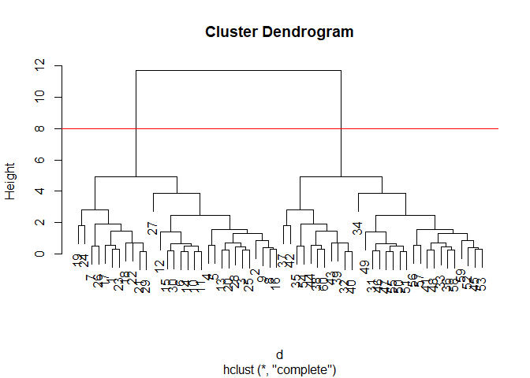

Once we have our `hclust` object (our “tree” of cluster dendrogram) we
can *“cut”* the tree to reveal the clustering pattern

``` r
cutree(hc, h =8)
```

     [1] 1 1 1 1 1 1 1 1 1 1 1 1 1 1 1 1 1 1 1 1 1 1 1 1 1 1 1 1 1 1 2 2 2 2 2 2 2 2
    [39] 2 2 2 2 2 2 2 2 2 2 2 2 2 2 2 2 2 2 2 2 2 2

> Q. Make a plot of `z` with your hclust results (i.e. colored by
> cluster membership)

``` r
grps <- cutree(hc, k = 2)
plot(z, col = grps)
```

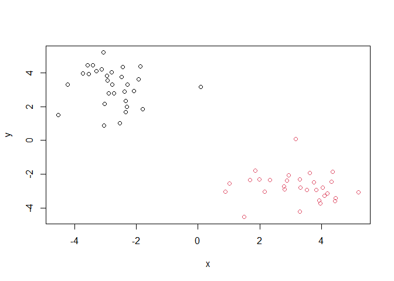

## Hands on with Principal Component Analysis (PCA)

PCA is a dimensionallity reduction method that is popular for revealing
patterns in complex datasets.

### Analysis of UK food data

Let’s look at some data on the eating habits of folks from the UK to see
if there are patterns and trends that have some regions being distinct
from others.

## Data Import

The data is made available in CSV format so we can use the `(read.csv)`
function for import to R:

``` r
url <- "https://tinyurl.com/UK-foods"
x <- read.csv(url)
x
```

                         X England Wales Scotland N.Ireland
    1               Cheese     105   103      103        66
    2        Carcass_meat      245   227      242       267
    3          Other_meat      685   803      750       586
    4                 Fish     147   160      122        93
    5       Fats_and_oils      193   235      184       209
    6               Sugars     156   175      147       139
    7      Fresh_potatoes      720   874      566      1033
    8           Fresh_Veg      253   265      171       143
    9           Other_Veg      488   570      418       355
    10 Processed_potatoes      198   203      220       187
    11      Processed_Veg      360   365      337       334
    12        Fresh_fruit     1102  1137      957       674
    13            Cereals     1472  1582     1462      1494
    14           Beverages      57    73       53        47
    15        Soft_drinks     1374  1256     1572      1506
    16   Alcoholic_drinks      375   475      458       135
    17      Confectionery       54    64       62        41

> Q1. How many rows and columns are in your new data frame named x? What
> R functions could you use to answer this question?

``` r
dim(x)
```

    [1] 17  5

There are 17 rows and 5 columns in this new data frame named X and the R
function used to answer this question is `dim(x)`

``` r
head(x)
```

                   X England Wales Scotland N.Ireland
    1         Cheese     105   103      103        66
    2  Carcass_meat      245   227      242       267
    3    Other_meat      685   803      750       586
    4           Fish     147   160      122        93
    5 Fats_and_oils      193   235      184       209
    6         Sugars     156   175      147       139

``` r
x <- read.csv(url, row.names=1)
head(x)
```

                   England Wales Scotland N.Ireland
    Cheese             105   103      103        66
    Carcass_meat       245   227      242       267
    Other_meat         685   803      750       586
    Fish               147   160      122        93
    Fats_and_oils      193   235      184       209
    Sugars             156   175      147       139

``` r
dim(x)
```

    [1] 17  4

## Tidy data

Fix anything that went wrong with data import. \> Q2. Which approach to
solving the ‘row-names problem’ mentioned above do you prefer and why?
Is one approach more robust than another under certain circumstances?

I prefer the second approach as the code is more straightforward than
the first option.

## Exploratory Analysis

``` r
barplot(as.matrix(x), beside=F, col=rainbow(nrow(x)))
```


> Q3. Changing what optional argument in the above barplot() function
> results in the following plot?

Changing the argument of beside to *False* results in the plot above as
it doesn’t call for columns of data to be right next to each other.

> Q4. Changing what optional argument in the above code results in a
> stacked barplot figure?

> Q5. We can use the pairs() function to generate all pairwise plots for
> our countries. Can you make sense of the following code and resulting
> figure? What does it mean if a given point lies on the diagonal for a
> given plot?

``` r
pairs(x, col=rainbow(nrow(x)), pch=16)
```

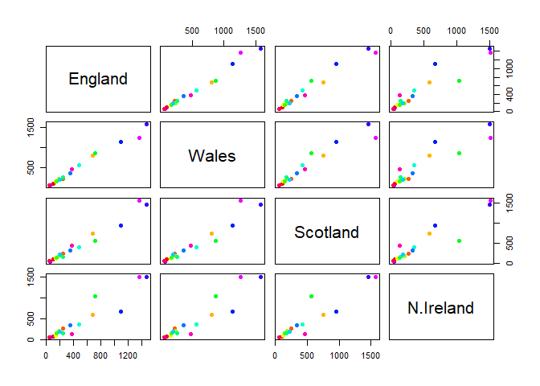

If a given plot lies diagonally for a given plot it is comparing data
with another given plot. For example, England plot is diagonal to the
plot for Wales and the data is being compared.

> Q6. Based on the pairs and heatmap figures, which countries cluster
> together and what does this suggest about their food consumption
> patterns? Can you easily tell what the main differences between N.
> Ireland and the other countries of the UK in terms of this data-set?

Based on the pairs and heatmap figures I would say that the countries
that cluster together are England, Wales, and Scotland while N.Ireland
is somewhat but not all that clustered with the rest of the counties.
This suggests that the countries that do cluster together have similar
food consumption patterns that are not shared with N.Ireland. I would
say that you can tell the main differences between N. Ireland and other
countries of the UK through this data set especially in the heat map as
the colors help note those differences.

> **Key-point**: Even relatively small datasets can prove challenging to
> interpret.

\##PCA to the rescue

The main function in “base” R for PCA is called `prcomp()`. This
function wants the “observations” to be rows and the “variables” to be
columns.

So here we need to take the tranpose of our `x` input object

``` r
pca <- prcomp( t(x) )
summary(pca)
```

    Importance of components:
                                PC1      PC2      PC3       PC4
    Standard deviation     324.1502 212.7478 73.87622 3.176e-14
    Proportion of Variance   0.6744   0.2905  0.03503 0.000e+00
    Cumulative Proportion    0.6744   0.9650  1.00000 1.000e+00

The returned `pca` pbject has components that we can use to make our
main result figures:

``` r
attributes(pca)
```

    $names
    [1] "sdev"     "rotation" "center"   "scale"    "x"       

    $class
    [1] "prcomp"

The main result figure from this analysis is called a **“PC SCORE
PLOT”**(a.k.a. an “ordination plot”, “PC plot” or simply “PC1 vs PC2
plot”).

This plot shows how samples (in this case countries) relate to each
other along our new PC axis.

> Q7. Complete the code below to generate a plot of PC1 vs PC2.

``` r
df <- as.data.frame(pca$x)
df$Country <- rownames(df)
```

``` r
library(ggplot2)
```

``` r
ggplot(pca$x) +
  aes(x = PC1, y = PC2, label = rownames(pca$x)) +
  geom_point(size = 3) +
  geom_text(vjust = -0.5) +
  xlim(-270, 500) +
  xlab("PC1") +
  ylab("PC2") +
  theme_bw()
```


> Q8. Customize your plot so that the colors of the country names match
> the colors in our UK and Ireland map and table at start of this
> document.

Below we can use the square of `pca$sdev` to calculate how much
variation in the original data each PC accounts for.

``` r
v <- round( pca$sdev^2/sum(pca$sdev^2) * 100 )
v
```

    [1] 67 29  4  0

``` r
z <- summary(pca)
z$importance
```

                                 PC1       PC2      PC3          PC4
    Standard deviation     324.15019 212.74780 73.87622 3.175833e-14
    Proportion of Variance   0.67444   0.29052  0.03503 0.000000e+00
    Cumulative Proportion    0.67444   0.96497  1.00000 1.000000e+00

This information can be summarized in a plot of the variances with
respect to the principal component number, which is given below.

``` r
variance_df <- data.frame(
  PC = factor(paste0("PC", 1:length(v)), levels = paste0("PC", 1:length(v))),
  Variance = v
)

ggplot(variance_df) +
  aes(x = PC, y = Variance) +
  geom_col(fill = "steelblue") +
  xlab("Principal Component") +
  ylab("Percent Variation") +
  theme_bw() +
  theme(axis.text.x = element_text(angle = 0))
```

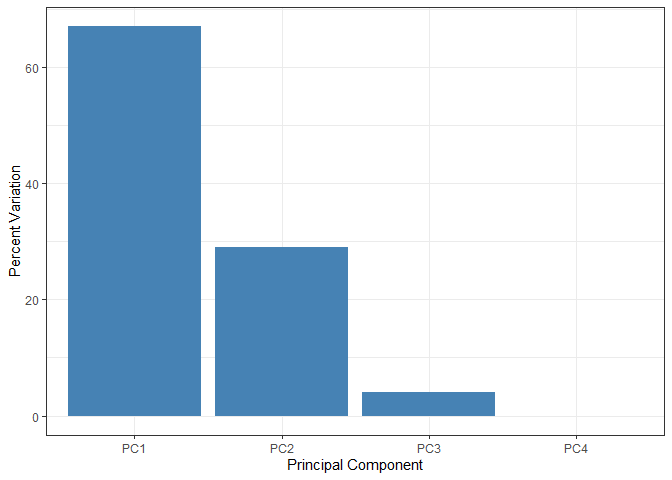

## Digging Deeper (variable loadings)

We can also consider the influence of each of the original variables
upon the principal components. This information can be obtained from the
`prcomp()` returned \$rotation component.

``` r
ggplot(pca$rotation) +
  aes(x = PC1, 
      y = reorder(rownames(pca$rotation), PC1)) +
  geom_col(fill = "steelblue") +
  xlab("PC1 Loading Score") +
  ylab("") +
  theme_bw() +
  theme(axis.text.y = element_text(size = 9))
```

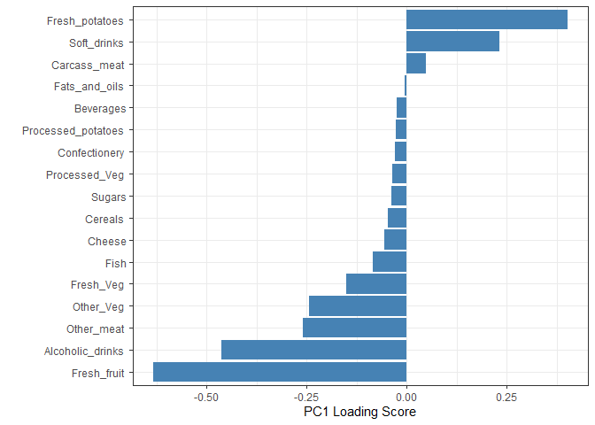

> Q9. Generate a similar ‘loadings plot’ for PC2. What two food groups
> feature prominantely and what does PC2 maninly tell us about?

``` r
ggplot(pca$rotation) +
  aes(x = PC2, 
      y = reorder(rownames(pca$rotation), PC2)) +
  geom_col(fill = "steelblue") +
  xlab("PC2 Loading Score") +
  ylab("") +
  theme_bw() +
  theme(axis.text.y = element_text(size = 9))
```

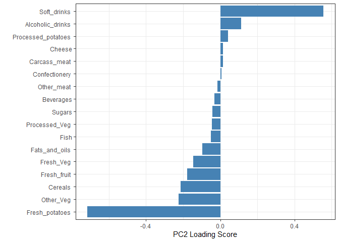

The two food groups that feature prominently on this plot are soft
drinks and fresh potatoes. PC2 mainly shows the foods that affect the
positive and negative loading scores.

> **Key-point**: PCA has the awesome ability to effectively reduce the
> dimensionality of our data set down from 17 to 2, allowing us to
> assert (using our figures above) that countries England, Wales and
> Scotland are ‘similar’ with Northern Ireland being different in some
> way.
