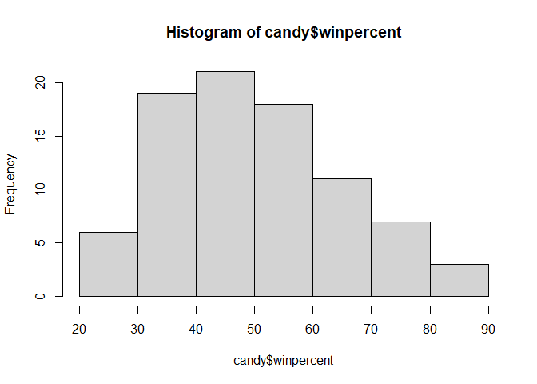
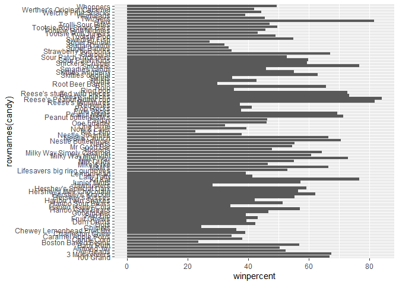
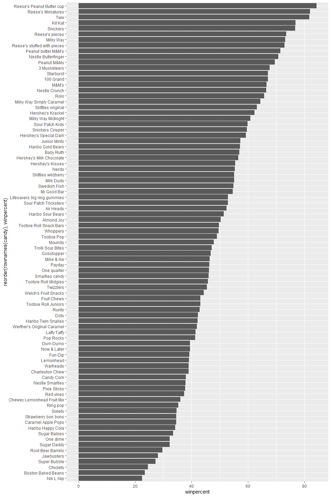
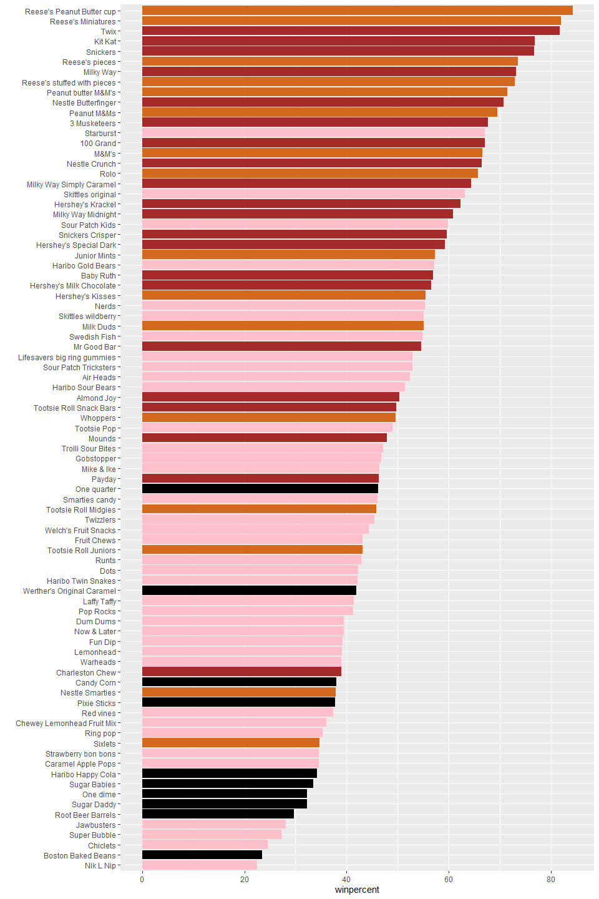
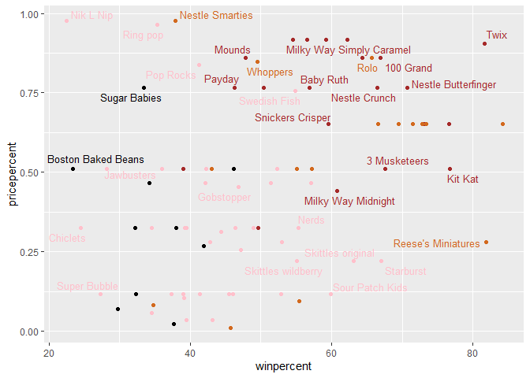
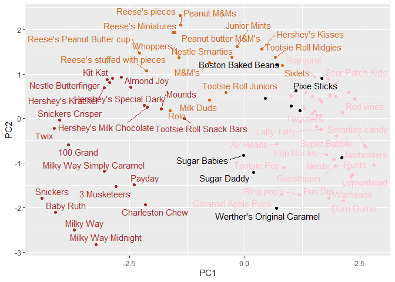
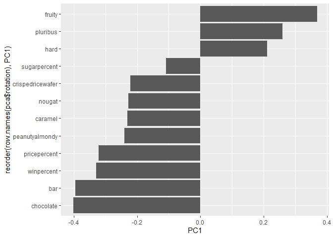

# Class 9: Candy Mini-Project
Alexia (A17297003)

- [Background](#background)
- [Importing Candy Data](#importing-candy-data)
- [Exploratory Analysis](#exploratory-analysis)
- [Overall Candy Rankings](#overall-candy-rankings)
- [Taking a look at pricepercent](#taking-a-look-at-pricepercent)
- [Exploring the Correlation
  Structure](#exploring-the-correlation-structure)
- [Principal Component Analysis](#principal-component-analysis)
- [Summary](#summary)

## Background

In this mini-project, we will explore FiveThirtyEight’s Halloween Candy
data set to find out what is the top ranked snack-sized Halloween candy?
and What made some candies more desirable than others? Amongst other
questions.

## Importing Candy Data

First things first, let’s get the data from the FiveThirtyEight GitHub
repo. We will download this candy-data.csv file and place it in the
project directory. Then, we will load it up with `read.csv()` and
inspect the data to see exactly what we’re dealing with.

``` r
candy <- read.csv("candy-data.txt", row.names = 1)

head(candy)
```

                 chocolate fruity caramel peanutyalmondy nougat crispedricewafer
    100 Grand            1      0       1              0      0                1
    3 Musketeers         1      0       0              0      1                0
    One dime             0      0       0              0      0                0
    One quarter          0      0       0              0      0                0
    Air Heads            0      1       0              0      0                0
    Almond Joy           1      0       0              1      0                0
                 hard bar pluribus sugarpercent pricepercent winpercent
    100 Grand       0   1        0        0.732        0.860   66.97173
    3 Musketeers    0   1        0        0.604        0.511   67.60294
    One dime        0   0        0        0.011        0.116   32.26109
    One quarter     0   0        0        0.011        0.511   46.11650
    Air Heads       0   0        0        0.906        0.511   52.34146
    Almond Joy      0   1        0        0.465        0.767   50.34755

> Q1. How many different candy types are in this dataset?

There are 85 different candy types in this data set.

> Q2. How many fruity candy types are in the dataset?

``` r
table(candy$fruity)
```


     0  1 
    47 38 

There are 38 fruity candy types in the data set.

> Q3. What is your favorite candy (other than Twix) in the dataset and
> what is it’s `winpercent` value?

``` r
candy["Snickers", ]$winpercent
```

    [1] 76.67378

> Q4. What is the `winpercent` value for “Kit Kat”?

``` r
candy["Kit Kat", ]$winpercent
```

    [1] 76.7686

> Q5. What is the `winpercent` value for “Tootsie Roll Snack Bars”?

``` r
candy["Tootsie Roll Snack Bars", ]$winpercent
```

    [1] 49.6535

**Side Note**: the skimr::skim() function There is a useful `skim()`
function in the skimr package that can help give us a quick overview of
a given data set. We will install this package and try it on our candy
data.

``` r
library("skimr")
skim(candy)
```

|                                                  |       |
|:-------------------------------------------------|:------|
| Name                                             | candy |
| Number of rows                                   | 85    |
| Number of columns                                | 12    |
| \_\_\_\_\_\_\_\_\_\_\_\_\_\_\_\_\_\_\_\_\_\_\_   |       |
| Column type frequency:                           |       |
| numeric                                          | 12    |
| \_\_\_\_\_\_\_\_\_\_\_\_\_\_\_\_\_\_\_\_\_\_\_\_ |       |
| Group variables                                  | None  |

Data summary

**Variable type: numeric**

| skim_variable | n_missing | complete_rate | mean | sd | p0 | p25 | p50 | p75 | p100 | hist |
|:---|---:|---:|---:|---:|---:|---:|---:|---:|---:|:---|
| chocolate | 0 | 1 | 0.44 | 0.50 | 0.00 | 0.00 | 0.00 | 1.00 | 1.00 | ▇▁▁▁▆ |
| fruity | 0 | 1 | 0.45 | 0.50 | 0.00 | 0.00 | 0.00 | 1.00 | 1.00 | ▇▁▁▁▆ |
| caramel | 0 | 1 | 0.16 | 0.37 | 0.00 | 0.00 | 0.00 | 0.00 | 1.00 | ▇▁▁▁▂ |
| peanutyalmondy | 0 | 1 | 0.16 | 0.37 | 0.00 | 0.00 | 0.00 | 0.00 | 1.00 | ▇▁▁▁▂ |
| nougat | 0 | 1 | 0.08 | 0.28 | 0.00 | 0.00 | 0.00 | 0.00 | 1.00 | ▇▁▁▁▁ |
| crispedricewafer | 0 | 1 | 0.08 | 0.28 | 0.00 | 0.00 | 0.00 | 0.00 | 1.00 | ▇▁▁▁▁ |
| hard | 0 | 1 | 0.18 | 0.38 | 0.00 | 0.00 | 0.00 | 0.00 | 1.00 | ▇▁▁▁▂ |
| bar | 0 | 1 | 0.25 | 0.43 | 0.00 | 0.00 | 0.00 | 0.00 | 1.00 | ▇▁▁▁▂ |
| pluribus | 0 | 1 | 0.52 | 0.50 | 0.00 | 0.00 | 1.00 | 1.00 | 1.00 | ▇▁▁▁▇ |
| sugarpercent | 0 | 1 | 0.48 | 0.28 | 0.01 | 0.22 | 0.47 | 0.73 | 0.99 | ▇▇▇▇▆ |
| pricepercent | 0 | 1 | 0.47 | 0.29 | 0.01 | 0.26 | 0.47 | 0.65 | 0.98 | ▇▇▇▇▆ |
| winpercent | 0 | 1 | 50.32 | 14.71 | 22.45 | 39.14 | 47.83 | 59.86 | 84.18 | ▃▇▆▅▂ |

> Q6. Is there any variable/column that looks to be on a different scale
> to the majority of the other columns in the dataset?

The following columns look to be on a different scale to the majority of
the other columns in the data set: sugarpercent, pricepercent, and
winpercent.

> Q7. What do you think a zero and one represent for the
> candy\$chocolate column?

I think the zero and one represent how much of the data is missing and
how much of the data is measured, respectively.

## Exploratory Analysis

A good place to start any exploratory analysis is with a histogram.You
can do this most easily with the base R function `hist()`.
Alternatively, you can use `ggplot()` with `geom_hist()`

> Q8. Plot a histogram of `winpercent` values using both base R and
> ggplot2.

``` r
hist(candy$winpercent)
```



> Q9. Is the distribution of `winpercent` values symmetrical?

The distribution of winpercent values is not symmetrical.

> Q10. Is the center of the distribution above or below 50%?

``` r
median(candy$winpercent)
```

    [1] 47.82975

The center of distribution is below 50%.

> Q11. On average is chocolate candy higher or lower ranked than fruit
> candy?

``` r
choc.ind <- as.logical(candy$chocolate)
choc.candy <- candy[choc.ind, ]
choc.win <- choc.candy$winpercent
mean(choc.win)
```

    [1] 60.92153

``` r
fruity.ind <- as.logical(candy$fruity)
fruity.candy <- candy[fruity.ind, ]
fruity.win <- fruity.candy$winpercent
mean(fruity.win)
```

    [1] 44.11974

On average chocolate candy is ranked higher than fruit candy.

> Q12. Is this difference statistically significant?

``` r
t.test(choc.win, fruity.win)
```


        Welch Two Sample t-test

    data:  choc.win and fruity.win
    t = 6.2582, df = 68.882, p-value = 2.871e-08
    alternative hypothesis: true difference in means is not equal to 0
    95 percent confidence interval:
     11.44563 22.15795
    sample estimates:
    mean of x mean of y 
     60.92153  44.11974 

This difference is statistically significant.

## Overall Candy Rankings

Let’s use the base R `order()` function together with `head()` to sort
the whole data set by a variable/column of interest.

> Q13. What are the five least liked candy types in this set?

``` r
head(candy[order(candy$winpercent),], n=5)
```

                       chocolate fruity caramel peanutyalmondy nougat
    Nik L Nip                  0      1       0              0      0
    Boston Baked Beans         0      0       0              1      0
    Chiclets                   0      1       0              0      0
    Super Bubble               0      1       0              0      0
    Jawbusters                 0      1       0              0      0
                       crispedricewafer hard bar pluribus sugarpercent pricepercent
    Nik L Nip                         0    0   0        1        0.197        0.976
    Boston Baked Beans                0    0   0        1        0.313        0.511
    Chiclets                          0    0   0        1        0.046        0.325
    Super Bubble                      0    0   0        0        0.162        0.116
    Jawbusters                        0    1   0        1        0.093        0.511
                       winpercent
    Nik L Nip            22.44534
    Boston Baked Beans   23.41782
    Chiclets             24.52499
    Super Bubble         27.30386
    Jawbusters           28.12744

The 5 least liked candies in this data set are Nik L Nip, Boston Baked
Beans, Chiclets, Super Bubble and Jawbusters.

> Q14. What are the top 5 all time favorite candy types out of this set?

``` r
head(candy[order(-candy$winpercent),], n=5)
```

                              chocolate fruity caramel peanutyalmondy nougat
    Reese's Peanut Butter cup         1      0       0              1      0
    Reese's Miniatures                1      0       0              1      0
    Twix                              1      0       1              0      0
    Kit Kat                           1      0       0              0      0
    Snickers                          1      0       1              1      1
                              crispedricewafer hard bar pluribus sugarpercent
    Reese's Peanut Butter cup                0    0   0        0        0.720
    Reese's Miniatures                       0    0   0        0        0.034
    Twix                                     1    0   1        0        0.546
    Kit Kat                                  1    0   1        0        0.313
    Snickers                                 0    0   1        0        0.546
                              pricepercent winpercent
    Reese's Peanut Butter cup        0.651   84.18029
    Reese's Miniatures               0.279   81.86626
    Twix                             0.906   81.64291
    Kit Kat                          0.511   76.76860
    Snickers                         0.651   76.67378

The 5 most liked candies in the data set are Reese’s Peanut Butter cup,
Reese’s Miniatures, Twix, Kit Kat, and Snickers.

> Q15. Make a first barplot of candy ranking based on winpercent values.

``` r
library(ggplot2)

ggplot(candy) + 
  aes(winpercent, rownames(candy)) +
  geom_col()
```



> Q16. This is quite ugly, use the `reorder()` function to get the bars
> sorted by `winpercent`?

``` r
ggplot(candy) + 
  aes(winpercent, reorder(rownames(candy), winpercent)) +
  geom_col()
```



Let’s setup a color vector (that signifies candy type) that we can then
use for some future plots.

``` r
mycols <- rep("black", nrow(candy))
mycols[as.logical(candy$chocolate)]="chocolate"
mycols[as.logical(candy$bar)]="brown"
mycols[as.logical(candy$fruity)]="pink"
```

``` r
ggplot(candy) + 
  aes(winpercent, reorder(rownames(candy),winpercent)) +
  geom_col(fill=mycols) +
  ylab("")
```



> Q17. What is the worst ranked chocolate candy?

The worst ranked chocolate candy is Sixlets.

> Q18. What is the best ranked fruity candy?

The best ranked fruity candy is Starburst.

## Taking a look at pricepercent

What about value for money? What is the best candy for the least money?
One way to get at this would be to make a plot of `winpercent` vs the
`pricepercent` variable.

``` r
library(ggrepel)

ggplot(candy) +
  aes(winpercent, 
      pricepercent, 
      label=rownames(candy)) + 
  geom_point(col=mycols) +   
  geom_text_repel(col=mycols, size = 3.3, max.overlaps=5)
```



> Q19. What about value for money? What is the best candy for the least
> money?

``` r
head(candy[order(candy$pricepercent),], n=3)
```

                         chocolate fruity caramel peanutyalmondy nougat
    Tootsie Roll Midgies         1      0       0              0      0
    Pixie Sticks                 0      0       0              0      0
    Dum Dums                     0      1       0              0      0
                         crispedricewafer hard bar pluribus sugarpercent
    Tootsie Roll Midgies                0    0   0        1        0.174
    Pixie Sticks                        0    0   0        1        0.093
    Dum Dums                            0    1   0        0        0.732
                         pricepercent winpercent
    Tootsie Roll Midgies        0.011   45.73675
    Pixie Sticks                0.023   37.72234
    Dum Dums                    0.034   39.46056

The best candy for the least amount of money is Tootsie Roll Midgies.

> Q20. What are the top 5 most expensive candy types in the dataset and
> of these which is the least popular?

``` r
head(candy[order(-candy$pricepercent),], n=5)
```

                             chocolate fruity caramel peanutyalmondy nougat
    Nik L Nip                        0      1       0              0      0
    Nestle Smarties                  1      0       0              0      0
    Ring pop                         0      1       0              0      0
    Hershey's Krackel                1      0       0              0      0
    Hershey's Milk Chocolate         1      0       0              0      0
                             crispedricewafer hard bar pluribus sugarpercent
    Nik L Nip                               0    0   0        1        0.197
    Nestle Smarties                         0    0   0        1        0.267
    Ring pop                                0    1   0        0        0.732
    Hershey's Krackel                       1    0   1        0        0.430
    Hershey's Milk Chocolate                0    0   1        0        0.430
                             pricepercent winpercent
    Nik L Nip                       0.976   22.44534
    Nestle Smarties                 0.976   37.88719
    Ring pop                        0.965   35.29076
    Hershey's Krackel               0.918   62.28448
    Hershey's Milk Chocolate        0.918   56.49050

The top 5 most expensive candy types are Nestle Smarties, Ring Pop, Nik
L Nip, Hershey’s Krackel, and Hershey’s Milk Chocolate. The least
popular amongst all of these is Nik L Nip.

## Exploring the Correlation Structure

Before we dive into PCA in the next section, it’s worth pausing to look
more closely at the correlations between all pairs of variables.

``` r
library(corrplot)
```

    corrplot 0.95 loaded

``` r
cij <- cor(candy)
corrplot(cij)
```


> Q22. Examining this plot what two variables are anti-correlated
> (i.e. have minus values)?

The two variables that are anti-correlated are fruity and chocolate,
fruity and bar, pluribus and bar.

> Q23. Use your corrplot result to make a prediction: which variables do
> you expect will have the largest contributions (i.e. loadings) to PC1
> (i.e., drive the most separation between candies along the first
> principal component)?

The variables we could expect to have the largest contributions to PC1
are fruity and chocolate.

## Principal Component Analysis

In this case we want to be sure to set `scale = TRUE` argument for
`prcomp()` because we have one variable `winpercent` that is on a very
different scale than all others and would otherwise dominate our PCA
results

``` r
pca <- prcomp(candy, scale = TRUE)
summary(pca)
```

    Importance of components:
                              PC1    PC2    PC3     PC4    PC5     PC6     PC7
    Standard deviation     2.0788 1.1378 1.1092 1.07533 0.9518 0.81923 0.81530
    Proportion of Variance 0.3601 0.1079 0.1025 0.09636 0.0755 0.05593 0.05539
    Cumulative Proportion  0.3601 0.4680 0.5705 0.66688 0.7424 0.79830 0.85369
                               PC8     PC9    PC10    PC11    PC12
    Standard deviation     0.74530 0.67824 0.62349 0.43974 0.39760
    Proportion of Variance 0.04629 0.03833 0.03239 0.01611 0.01317
    Cumulative Proportion  0.89998 0.93832 0.97071 0.98683 1.00000

First major result figure is the “score plot” of PC1 vs PC2 - how the
different candy are related to each other on our new PC axis:

``` r
ggplot(pca$x) +
  aes(PC1, PC2, label=row.names(pca$x))+
  geom_point(col=mycols)+
  geom_text_repel(col=mycols)
```



``` r
ggplot(pca$rotation) +
  aes(PC1, 
      reorder(row.names(pca$rotation), PC1)) +
  geom_col()
```



> Q24. Complete the code to generate the loadings plot above. What
> original variables are picked up strongly by PC1 in the positive
> direction? Do these make sense to you? Where did you see this
> relationship highlighted previously?

The original variables that are picked up strongly by PC1 in the
positive direction are fruity, pluribus, and hard. This makes sense as
we saw in the corrplot that there is no correlation between fruity and
chocolate therefore the divide in the data would be significant.

## Summary

> Q25. Based on your exploratory analysis, correlation findings, and PCA
> results, what combination of characteristics appears to make a
> “winning” candy? How do these different analyses (visualization,
> correlation, PCA) support or complement each other in reaching this
> conclusion?

The following combination of characteristics appears to make a “winning”
candy: chocolate, bar, peanuts, and nougat.

The plots generated with the data help identify these findings as they
show us multiple times that there is no correlation between fruity and
chocolate (corrplot) and also visually demonstrate that the most popular
candy type between chocolate and fruity is in fact chocolate
(Visualization).
