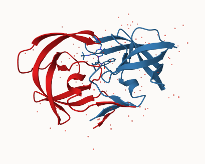
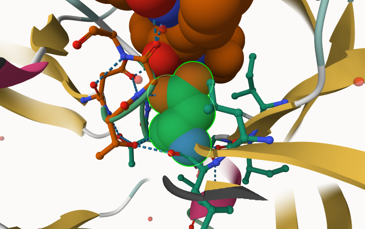
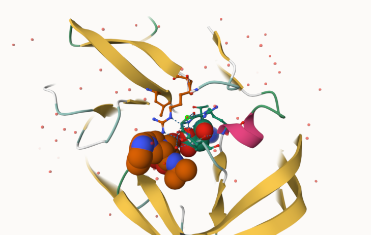
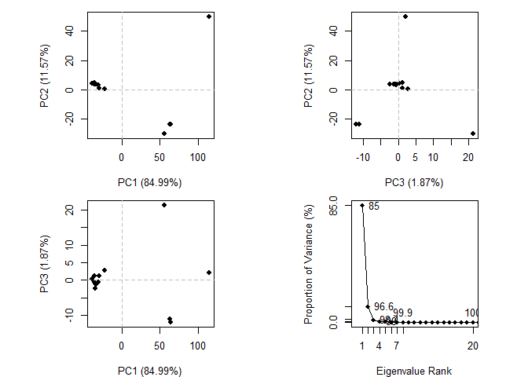
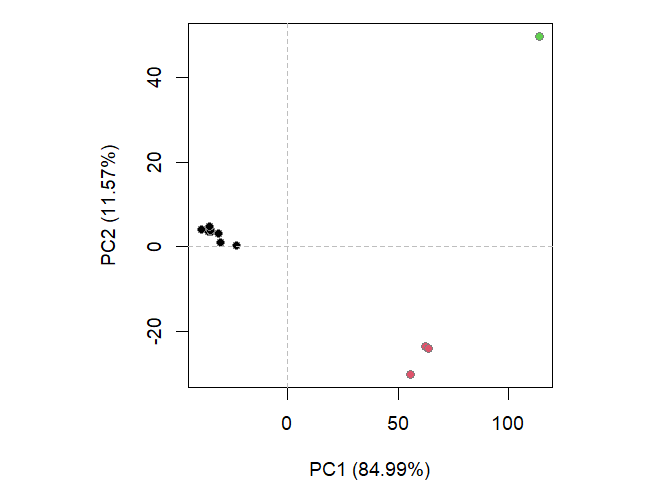

# Class 10: Structural Bioinformatics
Alexia (A17297003)

- [Background](#background)
- [PDB Statistics](#pdb-statistics)
- [Visualizing PDB data with
  Mol-star](#visualizing-pdb-data-with-mol-star)
- [Comparative structure analysis of Adenylate
  Kinase](#comparative-structure-analysis-of-adenylate-kinase)

## Background

The main repository of high-resolution structural data on biomolecules
is called the **Protein Data Bank** (PDB)

## PDB Statistics

In the first section of this lab we will interact with the main US based
PDB website.

We should download the CSV data file into our R Studio Project and use
it to answer the following questions (this data was obtained from the
RCSB PDB website an is current):

``` r
pdb <- read.csv("Data Export Summary.csv")
pdb
```

               Molecular.Type   X.ray     EM    NMR Integrative Multiple.methods
    1          Protein (only) 180,758 23,111 12,813         348              229
    2 Protein/Oligosaccharide  10,488  3,741     34           8               11
    3              Protein/NA   9,205  6,751    287          26                8
    4     Nucleic acid (only)   3,154    250  1,578           3               15
    5                   Other     178     27     35           4                0
    6  Oligosaccharide (only)      11      0      6           0                1
      Neutron Other   Total
    1      84    32 217,375
    2       1     0  14,283
    3       0     0  16,277
    4       3     1   5,004
    5       0     0     244
    6       0     4      22

The current print out above is “character” not “numeric”. Therefore we
have to use a function to change them in order to do math with it. Two
helpful functions are `sub()` and `as.numeric()`

``` r
# We want to get rid (or sub out) commas:
x <- pdb$X.ray
tmp <- sub (",", "", x )
sum(as.numeric(tmp))
```

    [1] 203794

We could make a function to do this:

``` r
rm.comma <- function(x) {
  tmp <- sub (",", "", x )
  sum(as.numeric(tmp))
}
```

``` r
rm.comma(pdb$EM)
```

    [1] 33880

We could also use a different import function for this CSV that speaks
American (i.e. deals with commas in numbers in a comma seperated value
file)

``` r
library(readr)

pdb <- read_csv("Data Export Summary.csv")
```

    Rows: 6 Columns: 9
    ── Column specification ────────────────────────────────────────────────────────
    Delimiter: ","
    chr (1): Molecular Type
    dbl (4): Integrative, Multiple methods, Neutron, Other
    num (4): X-ray, EM, NMR, Total

    ℹ Use `spec()` to retrieve the full column specification for this data.
    ℹ Specify the column types or set `show_col_types = FALSE` to quiet this message.

``` r
sum(pdb$`X-ray`)
```

    [1] 203794

> Q1. What percentage of structures in the PDB are solved by X-Ray and
> Electron Microscopy.

``` r
n.tot <- sum(pdb$Total)
n.xray <- sum(pdb$`X-ray`)
n.em <- sum(pdb$EM)

n.xray / n.tot * 100
```

    [1] 80.48577

``` r
n.em / n.tot * 100
```

    [1] 13.38046

80% of the structures in PDB are solved by X-ray and 13% are solved by
EM.

> Q2. What proportion of structures in the PDB are protein?

``` r
pdb$Total[1]
```

    [1] 217375

The total number of protein sequences in the UniProt is 202,556,314

``` r
217375/202556314 * 100
```

    [1] 0.1073158

0.1% of the structures in the PDB are protein.

> **Key-point**: We have a very, very small structural coverage of known
> proteins (~ 0.1%). Most structures we know about ( ~ 80%) come from
> one method (X-ray crystalography)

## Visualizing PDB data with Mol-star

Main stand alone web version with all features at
https://molstar.org/viewer/


  \> Q4: Water molecules normally
have 3 atoms. Why do we see just one atom per water molecule in this
structure?

We might just be seeing one atom per water molecule in this structure
because we are looking at this structure at the molecular level.

> Q5: There is a critical “conserved” water molecule in the binding
> site. Can you identify this water molecule? What residue number does
> this water molecule have

Residue number of water molecule: 324

> Q6: Generate and save a figure clearly showing the two distinct chains
> of HIV-protease along with the ligand. You might also consider showing
> the catalytic residues ASP 25 in each chain and the critical water

 \## Introduction to Bio3D in R

``` r
library(bio3d)
```

To read a single PDB file with Bio3D we can use the `read.pdb()`
function.

``` r
pdb <- read.pdb("1hsg")
```

      Note: Accessing on-line PDB file

To get a quick summary of the contents of the pdb object you just
created you can issue the command print(pdb) or simply type pdb

``` r
pdb
```


     Call:  read.pdb(file = "1hsg")

       Total Models#: 1
         Total Atoms#: 1686,  XYZs#: 5058  Chains#: 2  (values: A B)

         Protein Atoms#: 1514  (residues/Calpha atoms#: 198)
         Nucleic acid Atoms#: 0  (residues/phosphate atoms#: 0)

         Non-protein/nucleic Atoms#: 172  (residues: 128)
         Non-protein/nucleic resid values: [ HOH (127), MK1 (1) ]

       Protein sequence:
          PQITLWQRPLVTIKIGGQLKEALLDTGADDTVLEEMSLPGRWKPKMIGGIGGFIKVRQYD
          QILIEICGHKAIGTVLVGPTPVNIIGRNLLTQIGCTLNFPQITLWQRPLVTIKIGGQLKE
          ALLDTGADDTVLEEMSLPGRWKPKMIGGIGGFIKVRQYDQILIEICGHKAIGTVLVGPTP
          VNIIGRNLLTQIGCTLNF

    + attr: atom, xyz, seqres, helix, sheet,
            calpha, remark, call

> Q7: How many amino acid residues are there in this pdb object?

``` r
length(unique(pdb$atom$resno))
```

    [1] 227

> Q8: Name one of the two non-protein residues?

``` r
unique(pdb$atom$resid)
```

     [1] "PRO" "GLN" "ILE" "THR" "LEU" "TRP" "ARG" "VAL" "LYS" "GLY" "GLU" "ALA"
    [13] "ASP" "MET" "SER" "PHE" "TYR" "CYS" "HIS" "ASN" "MK1" "HOH"

``` r
aa <- c("ALA","ARG","ASN","ASP","CYS","GLN","GLU",
        "GLY","HIS","ILE","LEU","LYS","MET","PHE",
        "PRO","SER","THR","TRP","TYR","VAL")

unique(pdb$atom$resid[!pdb$atom$resid %in% aa])
```

    [1] "MK1" "HOH"

One of the two non-protein residues is HOH (water).

> Q9: How many protein chains are in this structure?

``` r
length(unique(pdb$atom$chain))
```

    [1] 2

## Comparative structure analysis of Adenylate Kinase

The goal of this section is to perform principal component analysis
(PCA) on the complete collection of Adenylate kinase structures in the
protein data-bank (PDB).

Adenylate kinase (often called simply Adk) is a ubiquitous enzyme that
functions to maintain the equilibrium between cytoplasmic nucleotides
essential for many cellular processes.

We will begin by first installing the packages we need.

> Q10. Which of the packages is found only on BioConductor and not CRAN?

The package found only on BioConductor and not CRAN is “msa”

> Q11. Which of the packages is not found on BioConductor or CRAN?:

The package not found on either BioConductor or CRAN is
“bioboot/bio3dview”

> Q12. True or False? Functions from the pak package can be used to
> install packages from GitHub and BitBucket?

False

> Q13. How many amino acids are in this sequence?

There are 214 amino acids in this sequence.

``` r
hits <- NULL
hits$pdb.id <- c('1AKE_A','6S36_A','6RZE_A','3HPR_A','1E4V_A','5EJE_A','1E4Y_A','3X2S_A','6HAP_A','6HAM_A','4K46_A','3GMT_A','4PZL_A')
```

The Blast search and subsequent filtering identified a total of 13
related PDB structures to our query sequence. We can now use function
`get.pdb()` and `pdbslit()` to fetch and parse the identified
structures.

``` r
files <- get.pdb(hits$pdb.id, path="pdbs", split=TRUE, gzip=TRUE)
```

    Warning in get.pdb(hits$pdb.id, path = "pdbs", split = TRUE, gzip = TRUE):
    pdbs/1AKE.pdb exists. Skipping download

    Warning in get.pdb(hits$pdb.id, path = "pdbs", split = TRUE, gzip = TRUE):
    pdbs/6S36.pdb exists. Skipping download

    Warning in get.pdb(hits$pdb.id, path = "pdbs", split = TRUE, gzip = TRUE):
    pdbs/6RZE.pdb exists. Skipping download

    Warning in get.pdb(hits$pdb.id, path = "pdbs", split = TRUE, gzip = TRUE):
    pdbs/3HPR.pdb exists. Skipping download

    Warning in get.pdb(hits$pdb.id, path = "pdbs", split = TRUE, gzip = TRUE):
    pdbs/1E4V.pdb exists. Skipping download

    Warning in get.pdb(hits$pdb.id, path = "pdbs", split = TRUE, gzip = TRUE):
    pdbs/5EJE.pdb exists. Skipping download

    Warning in get.pdb(hits$pdb.id, path = "pdbs", split = TRUE, gzip = TRUE):
    pdbs/1E4Y.pdb exists. Skipping download

    Warning in get.pdb(hits$pdb.id, path = "pdbs", split = TRUE, gzip = TRUE):
    pdbs/3X2S.pdb exists. Skipping download

    Warning in get.pdb(hits$pdb.id, path = "pdbs", split = TRUE, gzip = TRUE):
    pdbs/6HAP.pdb exists. Skipping download

    Warning in get.pdb(hits$pdb.id, path = "pdbs", split = TRUE, gzip = TRUE):
    pdbs/6HAM.pdb exists. Skipping download

    Warning in get.pdb(hits$pdb.id, path = "pdbs", split = TRUE, gzip = TRUE):
    pdbs/4K46.pdb exists. Skipping download

    Warning in get.pdb(hits$pdb.id, path = "pdbs", split = TRUE, gzip = TRUE):
    pdbs/3GMT.pdb exists. Skipping download

    Warning in get.pdb(hits$pdb.id, path = "pdbs", split = TRUE, gzip = TRUE):
    pdbs/4PZL.pdb exists. Skipping download


      |                                                                            
      |                                                                      |   0%
      |                                                                            
      |=====                                                                 |   8%
      |                                                                            
      |===========                                                           |  15%
      |                                                                            
      |================                                                      |  23%
      |                                                                            
      |======================                                                |  31%
      |                                                                            
      |===========================                                           |  38%
      |                                                                            
      |================================                                      |  46%
      |                                                                            
      |======================================                                |  54%
      |                                                                            
      |===========================================                           |  62%
      |                                                                            
      |================================================                      |  69%
      |                                                                            
      |======================================================                |  77%
      |                                                                            
      |===========================================================           |  85%
      |                                                                            
      |=================================================================     |  92%
      |                                                                            
      |======================================================================| 100%

Next we will use the `pdbaln()` function to align and also optionally
fit (i.e. superpose) the identified PDB structures.

``` r
pdbs <- pdbaln(files, fit = TRUE, exefile="msa")
```

    Reading PDB files:
    pdbs/split_chain/1AKE_A.pdb
    pdbs/split_chain/6S36_A.pdb
    pdbs/split_chain/6RZE_A.pdb
    pdbs/split_chain/3HPR_A.pdb
    pdbs/split_chain/1E4V_A.pdb
    pdbs/split_chain/5EJE_A.pdb
    pdbs/split_chain/1E4Y_A.pdb
    pdbs/split_chain/3X2S_A.pdb
    pdbs/split_chain/6HAP_A.pdb
    pdbs/split_chain/6HAM_A.pdb
    pdbs/split_chain/4K46_A.pdb
    pdbs/split_chain/3GMT_A.pdb
    pdbs/split_chain/4PZL_A.pdb
       PDB has ALT records, taking A only, rm.alt=TRUE
    .   PDB has ALT records, taking A only, rm.alt=TRUE
    .   PDB has ALT records, taking A only, rm.alt=TRUE
    .   PDB has ALT records, taking A only, rm.alt=TRUE
    ..   PDB has ALT records, taking A only, rm.alt=TRUE
    ....   PDB has ALT records, taking A only, rm.alt=TRUE
    .   PDB has ALT records, taking A only, rm.alt=TRUE
    ...

    Extracting sequences

    pdb/seq: 1   name: pdbs/split_chain/1AKE_A.pdb 
       PDB has ALT records, taking A only, rm.alt=TRUE
    pdb/seq: 2   name: pdbs/split_chain/6S36_A.pdb 
       PDB has ALT records, taking A only, rm.alt=TRUE
    pdb/seq: 3   name: pdbs/split_chain/6RZE_A.pdb 
       PDB has ALT records, taking A only, rm.alt=TRUE
    pdb/seq: 4   name: pdbs/split_chain/3HPR_A.pdb 
       PDB has ALT records, taking A only, rm.alt=TRUE
    pdb/seq: 5   name: pdbs/split_chain/1E4V_A.pdb 
    pdb/seq: 6   name: pdbs/split_chain/5EJE_A.pdb 
       PDB has ALT records, taking A only, rm.alt=TRUE
    pdb/seq: 7   name: pdbs/split_chain/1E4Y_A.pdb 
    pdb/seq: 8   name: pdbs/split_chain/3X2S_A.pdb 
    pdb/seq: 9   name: pdbs/split_chain/6HAP_A.pdb 
    pdb/seq: 10   name: pdbs/split_chain/6HAM_A.pdb 
       PDB has ALT records, taking A only, rm.alt=TRUE
    pdb/seq: 11   name: pdbs/split_chain/4K46_A.pdb 
       PDB has ALT records, taking A only, rm.alt=TRUE
    pdb/seq: 12   name: pdbs/split_chain/3GMT_A.pdb 
    pdb/seq: 13   name: pdbs/split_chain/4PZL_A.pdb 

The function `pdb.annotate()` provides a convenient way of annotating
the PDB files we have collected. Below we use the function to annotate
each structure to its source species. This will come in handy when
annotating plots later on:

``` r
ids <- basename.pdb(pdbs$id)

anno <- pdb.annotate(ids)
unique(anno$source)
```

    [1] "Escherichia coli"                                
    [2] "Escherichia coli K-12"                           
    [3] "Escherichia coli O139:H28 str. E24377A"          
    [4] "Escherichia coli str. K-12 substr. MDS42"        
    [5] "Photobacterium profundum"                        
    [6] "Burkholderia pseudomallei 1710b"                 
    [7] "Francisella tularensis subsp. tularensis SCHU S4"

We can view all available annotation data: `anno`

Function `pca()` provides principal component analysis (PCA) of the
structure data. PCA can be performed on the structural ensemble (stored
in the pdbs object) with the function `pca.xyz()`, or more simply
`pca()`.

``` r
pc.xray <- pca(pdbs)
plot(pc.xray)
```



Function `rmsd()` will calculate all pairwise RMSD values of the
structural ensemble. This facilitates clustering analysis based on the
pairwise structural deviation:

``` r
rd <- rmsd(pdbs)
```

    Warning in rmsd(pdbs): No indices provided, using the 204 non NA positions

``` r
hc.rd <- hclust(dist(rd))
grps.rd <- cutree(hc.rd, k=3)

plot(pc.xray, 1:2, col="grey50", bg=grps.rd, pch=21, cex=1)
```



To visualize the major structural variations in the ensemble the
function `mktrj()` can be used to generate a trajectory PDB file by
interpolating along a give PC (eigenvector):

``` r
pc1 <- mktrj(pc.xray, pc=1, file="pc_1.pdb")
```

We can now open this file, pc_1.pdb, in Mol\*.
