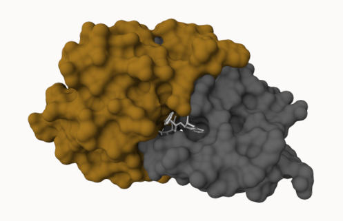

## Background
The main repository of high-resolution structural data on biomolecules is called the **Protein Data Bank** (PDB)

## PDB Statistics
In the first section of this lab we will interact with the main US based PDB website.

We should download the CSV data file into our R Studio Project and use it to answer the following questions (this data was obtained from the RCSB PDB website an is current): 

```{r}
pdb <- read.csv("Data Export Summary.csv")
pdb
```
The current print out above is "character" not "numeric". Therefore we have to use a function to change them in order to do math with it. Two helpful functions are `sub()` and `as.numeric()`

```{r}
# We want to get rid (or sub out) commas:
x <- pdb$X.ray
tmp <- sub (",", "", x )
sum(as.numeric(tmp))
```
We could make a function to do this:
```{r}
rm.comma <- function(x) {
  tmp <- sub (",", "", x )
  sum(as.numeric(tmp))
}
```
```{r}
rm.comma(pdb$EM)
```
We could also use a different import function for this CSV that speaks American (i.e. deals with commas in numbers in a comma seperated value file)

```{r}
library(readr)

pdb <- read_csv("Data Export Summary.csv")
```
```{r}
sum(pdb$`X-ray`)
```
> Q1. What percentage of structures in the PDB are solved by X-Ray and Electron Microscopy.

```{r}
n.tot <- sum(pdb$Total)
n.xray <- sum(pdb$`X-ray`)
n.em <- sum(pdb$EM)

n.xray / n.tot * 100
n.em / n.tot * 100
```
80% of the structures in PDB are solved by X-ray and 13% are solved by EM.

> Q2. What proportion of structures in the PDB are protein?

```{r}
pdb$Total[1]
```
The total number of protein sequences in the UniProt is 202,556,314
```{r}
217375/202556314 * 100
```
0.1% of the structures in the PDB are protein.

> **Key-point**: We have a very, very small structural coverage of known proteins (~ 0.1%). Most structures we know about ( ~ 80%) come from one method (X-ray crystalography)

## Visualizing PDB data with Mol-star
Main stand alone web version with all features at https://molstar.org/viewer/




> Q4: Water molecules normally have 3 atoms. Why do we see just one atom per water molecule in this structure?

We might just be seeing one atom per water molecule in this structure because we are looking at this structure at the molecular level. 

> Q5: There is a critical “conserved” water molecule in the binding site. Can you identify this water molecule? What residue number does this water molecule have

Residue number of water molecule: 324

> Q6: Generate and save a figure clearly showing the two distinct chains of HIV-protease along with the ligand. You might also consider showing the catalytic residues ASP 25 in each chain and the critical water


## Introduction to Bio3D in R
```{r}
library(bio3d)
```
To read a single PDB file with Bio3D we can use the `read.pdb()` function. 
```{r}
pdb <- read.pdb("1hsg")
```
To get a quick summary of the contents of the pdb object you just created you can issue the command print(pdb) or simply type pdb
```{r}
pdb
```
> Q7: How many amino acid residues are there in this pdb object? 

```{r}
length(unique(pdb$atom$resno))
```
> Q8: Name one of the two non-protein residues? 

```{r}
unique(pdb$atom$resid)
```
```{r}
aa <- c("ALA","ARG","ASN","ASP","CYS","GLN","GLU",
        "GLY","HIS","ILE","LEU","LYS","MET","PHE",
        "PRO","SER","THR","TRP","TYR","VAL")

unique(pdb$atom$resid[!pdb$atom$resid %in% aa])
```
One of the two non-protein residues is HOH (water).

> Q9: How many protein chains are in this structure?

```{r}
length(unique(pdb$atom$chain))
```
## Comparative structure analysis of Adenylate Kinase
The goal of this section is to perform principal component analysis (PCA) on the complete collection of Adenylate kinase structures in the protein data-bank (PDB).

Adenylate kinase (often called simply Adk) is a ubiquitous enzyme that functions to maintain the equilibrium between cytoplasmic nucleotides essential for many cellular processes.

We will begin by first installing the packages we need.

> Q10. Which of the packages is found only on BioConductor and not CRAN? 

The package found only on BioConductor and not CRAN is "msa"

> Q11. Which of the packages is not found on BioConductor or CRAN?: 

The package not found on either BioConductor or CRAN is "bioboot/bio3dview"

> Q12. True or False? Functions from the pak package can be used to install packages from GitHub and BitBucket?

False

> Q13. How many amino acids are in this sequence?

There are 214 amino acids in this sequence. 

```{r}
hits <- NULL
hits$pdb.id <- c('1AKE_A','6S36_A','6RZE_A','3HPR_A','1E4V_A','5EJE_A','1E4Y_A','3X2S_A','6HAP_A','6HAM_A','4K46_A','3GMT_A','4PZL_A')
```
The Blast search and subsequent filtering identified a total of 13 related PDB structures to our query sequence. We can now use function `get.pdb()` and `pdbslit()` to fetch and parse the identified structures.
```{r}
files <- get.pdb(hits$pdb.id, path="pdbs", split=TRUE, gzip=TRUE)
```

Next we will use the `pdbaln()` function to align and also optionally fit (i.e. superpose) the identified PDB structures.
```{r}
pdbs <- pdbaln(files, fit = TRUE, exefile="msa")
```

The function `pdb.annotate()` provides a convenient way of annotating the PDB files we have collected. Below we use the function to annotate each structure to its source species. This will come in handy when annotating plots later on:
```{r}
ids <- basename.pdb(pdbs$id)

anno <- pdb.annotate(ids)
unique(anno$source)
```
We can view all available annotation data: `anno`

Function `pca()` provides principal component analysis (PCA) of the structure data. PCA can be performed on the structural ensemble (stored in the pdbs object) with the function `pca.xyz()`, or more simply `pca()`.

```{r}
pc.xray <- pca(pdbs)
plot(pc.xray)
```
Function `rmsd()` will calculate all pairwise RMSD values of the structural ensemble. This facilitates clustering analysis based on the pairwise structural deviation:
```{r}
rd <- rmsd(pdbs)

hc.rd <- hclust(dist(rd))
grps.rd <- cutree(hc.rd, k=3)

plot(pc.xray, 1:2, col="grey50", bg=grps.rd, pch=21, cex=1)
```
To visualize the major structural variations in the ensemble the function `mktrj()` can be used to generate a trajectory PDB file by interpolating along a give PC (eigenvector):
```{r}
pc1 <- mktrj(pc.xray, pc=1, file="pc_1.pdb")
```
We can now open this file, pc_1.pdb, in Mol*.
