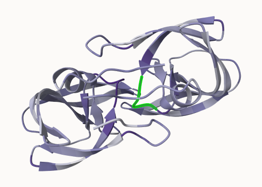

## Background
Proteins are natures robots responsible for nearly every task in living organisms. Just as robots are programmed to perform specific tasks, proteins, through their distinct 3D shapes (known as their atomic structures), carry out diverse functions from catalysis, signaling and transport to replication, division and movement. 

## Generating your own structure predictions - ColabFold
For this lab we will use the HIV-Pr Dimer sequence: 
>HIV-Pr-Dimer
PQITLWQRPLVTIKIGGQLKEALLDTGADDTVLEEMSLPGRWKPKMIGGIGGFIKVRQYD
QILIEICGHKAIGTVLVGPTPVNIIGRNLLTQIGCTLNF:PQITLWQRPLVTIKIGGQLK
EALLDTGADDTVLEEMSLPGRWKPKMIGGIGGFIKVRQYDQILIEICGHKAIGTVLVGPT
PVNIIGRNLLTQIGCTLNF

We will use AlphaFold2_mmseqs2 Colab notebook to generate a prediction of the 3D structure/model of the amino acid sequence (HIV-PR-Dimer).

## Interpreting Results
Once the zip file has been downloaded we will uncompress it to begin result interpretation. Inside the resulting folder/directory we will have a number of .txt, .json, and .pdb files. 

## Visualization of the models and their estimated reliability
We can use Mol* for visualization of the model PDB files.

**Key Note**: The B-factor column of each AlphaFold produced PDB file contains the per-residue pLDDT score (a measure of the estimated reliability, or confidence score per-residue) Values above 70 are considered high confidence whereas those scored below 50 are low confidence and hence unreliable.

## Custom analysis of resulting models
In this section we will read the results of the more complicated HIV-Pr dimer AlphaFold2 models into R with the help of the Bio3D package.For tidiness we can move our AlphaFold results directory into our RStudio project directory.
```{r}
results_dir <- "hivprdimer_23119" 
```
```{r}
pdb_files <- list.files(path=results_dir,
                        pattern="*.pdb",
                        full.names = TRUE)
basename(pdb_files)
```
```{r}
library(bio3d)
pdbs <- pdbaln(pdb_files, fit=TRUE, exefile="msa")
```
A quick view of model sequences:
```{r}
pdbs
```
RMSD is a standard measure of structural distance between coordinate sets. We can use the `rmsd()` function to calculate the RMSD between all pairs models.
```{r}
rd <- rmsd(pdbs, fit=T)
```
```{r}
range(rd)
```
Draw a heatmap of these RMSD matrix values:
```{r}
library(pheatmap)

colnames(rd) <- paste0("m",1:5)
rownames(rd) <- paste0("m",1:5)
pheatmap(rd)
```
Here we can see that models 1, 2, and 3 are almost identical to each other while models 4 and 5 share some similarities but are not fully identical in turn making them not as similar as models 1-3. We will see this trend again in the pLDDT and PAE plots further below.

Now lets plot the pLDDT values across all models. Recall that this information is in the B-factor column of each model and that this is stored in our aligned pdbs object as pdbs$b with a row per structure/model.
```{r}
pdb <- read.pdb("1hsg")
```
You could optionally obtain secondary structure from a call to stride() or dssp() on any of the model structures.
```{r}
plotb3(pdbs$b[1,], typ="l", lwd=2, sse=pdb)
points(pdbs$b[2,], typ="l", col="red")
points(pdbs$b[3,], typ="l", col="blue")
points(pdbs$b[4,], typ="l", col="darkgreen")
points(pdbs$b[5,], typ="l", col="orange")
abline(v=100, col="gray")
```
We can improve the superposition/fitting of our models by finding the most consistent “rigid core” common across all the models. For this we will use the `core.find()` function:
```{r}
core <- core.find(pdbs)
```
We can now use the identified core atom positions as a basis for a more suitable superposition and write out the fitted structures to a directory called corefit_structures:
```{r}
core.inds <- print(core, vol=0.5)
```
```{r}
xyz <- pdbfit(pdbs, core.inds, outpath="corefit_structures")
```
The resulting superposed coordinates are written to a new director called corefit_structures/. We can now open these in Mol* and color by the Atom Property of Uncertainty/Disorder.

Now we can examine the RMSF between positions of the structure. RMSF is an often used measure of conformational variance along the structure:
```{r}
rf <- rmsf(xyz)

plotb3(rf, sse=pdb)
abline(v=100, col="gray", ylab="RMSF")
```
Here we see that the first chain is much more variable than the second chain. The second chain is very similar across the different models - we saw this in Mol* previously. 

## Predicted Alignment Error for domains
Independent of the 3D structure, AlphaFold produces an output called Predicted Aligned Error (PAE). This is detailed in the JSON format result files, one for each model structure.
```{r}
library(jsonlite)

pae_files <- list.files(path=results_dir,
                        pattern=".*model.*\\.json",
                        full.names = TRUE)
```
For example purposes lets read the 1st and 5th files (you can read the others and make similar plots).
```{r}
pae1 <- read_json(pae_files[1],simplifyVector = TRUE)
pae5 <- read_json(pae_files[5],simplifyVector = TRUE)

attributes(pae1)
```
```{r}
head(pae1$plddt) 
```
The maximum PAE values are useful for ranking models. Here we can see that model 5 is much worse than model 6. The lower the PAE score the better. How about the other models, what are their max PAE scores?

```{r}
pae1$max_pae
```
```{r}
pae5$max_pae
```
We can plot the N by N (where N is the number of residues) PAE scores with ggplot or with functions from the Bio3D package:
```{r}
plot.dmat(pae1$pae, 
          xlab="Residue Position (i)",
          ylab="Residue Position (j)")
```
```{r}
plot.dmat(pae5$pae, 
          xlab="Residue Position (i)",
          ylab="Residue Position (j)",
          grid.col = "black",
          zlim=c(0,30))
```
We should really plot all of these using the same z range. Here is the model 1 plot again but this time using the same data range as the plot for model 5:
```{r}
plot.dmat(pae1$pae, 
          xlab="Residue Position (i)",
          ylab="Residue Position (j)",
          grid.col = "black",
          zlim=c(0,30))
```
## Residue conservation from alignment file
```{r}
aln_file <- list.files(path=results_dir,
                       pattern=".a3m$",
                        full.names = TRUE)
aln_file
```
```{r}
aln <- read.fasta(aln_file[1], to.upper = TRUE)
```
How many sequences are in this alignment?
```{r}
dim(aln$ali)
```
We can score residue conservation in the alignment with the `conserv()` function.
```{r}
sim <- conserv(aln)
```
```{r}
plotb3(sim[1:99], sse=trim.pdb(pdb, chain="A"),
       ylab="Conservation Score")
```
Note the conserved Active Site residues D25, T26, G27, A28. These positions will stand out if we generate a consensus sequence with a high cutoff value:
```{r}
con <- consensus(aln, cutoff = 0.9)
con$seq
```
For a final visualization of these functionally important sites we can map this conservation score to the Occupancy column of a PDB file for viewing in molecular viewer programs such as Mol*, PyMol, VMD, chimera etc.
```{r}
m1.pdb <- read.pdb(pdb_files[1])
occ <- vec2resno(c(sim[1:99], sim[1:99]), m1.pdb$atom$resno)
write.pdb(m1.pdb, o=occ, file="m1_conserv.pdb")
```
Here is an image of this data generated from and Mol* using coloring by Occupancy. This is done in a similar manor to the pLDDT coloring procedure detailed above

Note that we can now clearly see the central conserved active site in this model where the natural peptide substrate (and small molecule inhibitors) would bind between domains. The DTGA motif of one chain is highlighted in green
