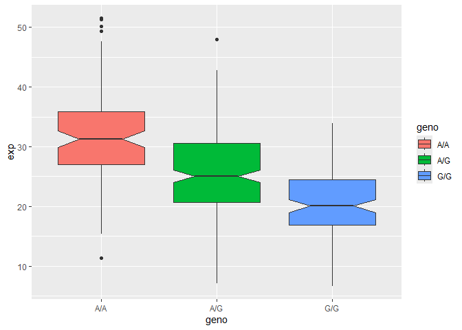

# Class 12: Intro to Genome Informatics
Alexia (A17297003)

- [Section 1. Proportion of G/G in a
  population](#section-1-proportion-of-gg-in-a-population)
- [Section 4. Population Scale Analysis
  (Homework)](#section-4-population-scale-analysis-homework)

## Section 1. Proportion of G/G in a population

Downloaded a CSV file from Ensemble \<
https://www.ensembl.org/Homo_sapiens/Variation/Sample?db=core;r=17:39894595-39895595;v=rs8067378;vdb=variation;vf=959672880#373531_tablePanel
\>

Here we read this CSV file

``` r
mxl <- read.csv("373531-SampleGenotypes-Homo_sapiens_Variation_Sample_rs8067378.csv")
head(mxl)
```

      Sample..Male.Female.Unknown. Genotype..forward.strand. Population.s. Father
    1                  NA19648 (F)                       A|A ALL, AMR, MXL      -
    2                  NA19649 (M)                       G|G ALL, AMR, MXL      -
    3                  NA19651 (F)                       A|A ALL, AMR, MXL      -
    4                  NA19652 (M)                       G|G ALL, AMR, MXL      -
    5                  NA19654 (F)                       G|G ALL, AMR, MXL      -
    6                  NA19655 (M)                       A|G ALL, AMR, MXL      -
      Mother
    1      -
    2      -
    3      -
    4      -
    5      -
    6      -

``` r
table(mxl$Genotype..forward.strand.)
```


    A|A A|G G|A G|G 
     22  21  12   9 

``` r
table(mxl$Genotype..forward.strand.) / nrow(mxl) * 100
```


        A|A     A|G     G|A     G|G 
    34.3750 32.8125 18.7500 14.0625 

Now let’s look at a different population. I picked the GBR.

``` r
gbr <- read.csv("373522-SampleGenotypes-Homo_sapiens_Variation_Sample_rs8067378.csv")
```

Find proportion of G\|G

``` r
table(gbr$Genotype..forward.strand.) / nrow(gbr) * 100
```


         A|A      A|G      G|A      G|G 
    25.27473 18.68132 26.37363 29.67033 

This variant that is associated with childhood asthma is more frequent
in the GBR population than the MKL population.

Lets now dig into this further.

## Section 4. Population Scale Analysis (Homework)

One sample is obviously not enough to know what is happening in a
population. You are interested in assessing genetic differences on a
population scale.

> Q13: Read file “rs8067378…” into R and determine the sample size for
> each genotype and their corresponding median expression levels for
> each of these genotypes.

``` r
expr <- read.table("rs8067378_ENSG00000172057.6.txt")
head(expr)
```

       sample geno      exp
    1 HG00367  A/G 28.96038
    2 NA20768  A/G 20.24449
    3 HG00361  A/A 31.32628
    4 HG00135  A/A 34.11169
    5 NA18870  G/G 18.25141
    6 NA11993  A/A 32.89721

``` r
nrow(expr)
```

    [1] 462

Sample size for each genotype:

``` r
table(expr$geno)
```


    A/A A/G G/G 
    108 233 121 

``` r
library(ggplot2)
```

Let’s make a boxplot to be able to find the corresponding median
expression levels for each genotype:

``` r
ggplot(expr) + aes(geno, exp, fill=geno) + 
  geom_boxplot(notch=TRUE)
```



Based on the generated boxplot we can infer that the median expression
levels for the A/A, A/G, and G/G genotype are 32, 25, and 20
respectively.

> Q14: Generate a boxplot with a box per genotype, what could you infer
> from the relative expression value between A/A and G/G displayed in
> this plot? Does the SNP effect the expression of ORMDL3?

From the relative expression values of A/A and G/G displayed in the plot
it can be inferred that the A/A genotype has higher expression level and
therefore more gene activity compared to the G/G genotype. So, we can
conclude that SNP does affect the expression of ORMDL3.
