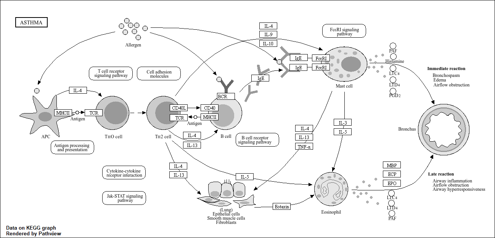

## Background 

Today we're going to do an RNA seq-analysis of a data set on the common glucocorticoid steroid dexamethasone (dex), and we'll use DESeq for this analysis.

## Data Import

Let's read the `count` data and `metadata` about this experiment setup from the supplied CSV files:
```{r}
counts <- read.csv("airway_scaledcounts.csv", row.names=1)
metadata <- read.csv("airway_metadata.csv")
```
Have a peak:
```{r}
head(counts)
```
and the metadata tells us what is actually in the columns of our `counts` object:
```{r}
metadata
```
> Q1. How many genes are in this dataset? 

There are `r nrow(counts)` genes in this dataset.

> Q2. How many ‘control’ cell lines do we have?

```{r}
table(metadata$dex)
```
There are 4 control cell lines. 

- Find the "control" columns in our `counts` object 
- Extract just the "control" column values for all genes 
- Calculate the average value per gene in these "control" columns 

```{r}
control.inds <- metadata$dex == "control"
control.counts <- counts[ , control.inds ]
control.mean <- rowMeans(control.counts)
```
> Q3. How would you make the above code in either approach more robust? Is there a function that could help here? 

A function that could help make either approach more robust is subbing == for %in%, adding drop = FALSE to the second line of code, and na.rm = TRUE to the third line of code. This would ensure robustness and avoids certain issues. 

> Q4. Follow the same procedure for the treated samples:

```{r}
treated.inds <- metadata$dex == "treated"
treated.counts <- counts[ , treated.inds ]
treated.mean <- rowMeans(treated.counts)
```
Make a plot of `control.mean` vs `treated.mean` and for book-keeping let's store these together as a new object called `meancounts`
```{r}
meancounts <- data.frame(control.mean, treated.mean)
head(meancounts)
```
> Q5. Create a scatter plot showing the mean of the treated samples against the mean of the control samples. 

```{r}
plot(meancounts[,1],meancounts[,2], xlab="Control", ylab="Treated")
```
Our count data is highly skewed and when we see a pattern like this plot it SCREAMS log transform me!

> Q6. Try plotting both axes on a log scale. What is the argument to `plot()` that allows you to do this?

```{r}
plot(meancounts, log="xy")
```
We most often use log2 transform for this kind of data in bioinformatics. 

Let's calculate the log2 fold change for our `treated.mean` and `control.mean` counts and call this `log2fc`.
```{r}
meancounts$log2fc <- log2(meancounts[,"treated.mean"]/meancounts[,"control.mean"])
head(meancounts)
```
A common "rule of thumb" threshold for calling a gene "up regulated" or "down regulated" is a log2 fold-change value of +2 or -2 (greater)

Let’s filter our data to remove the genes that returned Nan and -Inf:
```{r}
zero.vals <- which(meancounts[,1:2]==0, arr.ind=TRUE)

to.rm <- unique(zero.vals[,1])
mycounts <- meancounts[-to.rm,]
head(mycounts)
```
> Q7. What is the purpose of the `arr.ind` argument in the `which()` function call above? Why would we then take the first column of the output and need to call the `unique()` function?

The purpose of the arr.ind argument in the which() function is to return the true values presented in the rows. Calling the unique function of the first column most likely calls for the removal of values in the column that don't count as a numerical value. 

> Q8. Using the up.ind vector above can you determine how many up regulated genes we have at the greater than 2 fc level?

```{r}
up.ind <- mycounts$log2fc > 2
down.ind <- mycounts$log2fc < (-2)
sum(up.ind)
```
There are 250 upregulated genes at the greater than 2 fc level.

## DESeq Analysis

Let's do this analysis properly and not forget about the significance of the differences. For this we will use the **DESeq2** package
```{r, message=FALSE} 
library(DESeq2)
```
To run a DESeq analysis we need at least two inputs:

- `countData` i.e. our gene counts across different experiments
- `colData` i.e. our metadata about those count columns

```{r, warning=FALSE}
dds <- DESeqDataSetFromMatrix(countData=counts, 
                              colData=metadata, 
                              design=~dex)
dds
```
Now we can run the DESeq analysis pipeline using this `dds` object that has all the inputs we need.

```{r}
dds <- DESeq(dds)
res <- results(dds)
head(res)
```
## Data Visualization - Volcano Plot

This is a ubiquitous and common visualization for this type of data that puts the log2 fold change and the adjusted p-value together in one plot that people can get insight for what is going on in the whole data set results. 

```{r}
library(ggplot2)
```
```{r, warning=FALSE}
ggplot(res)+
  aes(log2FoldChange, -log(padj))+
  geom_point()
```
> Q. Add annotation to this volcano plot including the log2 fold change threshold of +2 and -2 and the p-value threshold of 0.05. Also color up just the genes that meet both these thresholds. These are the ones we will focus on next class. 

To make this more useful we can add some guidelines (with the `abline()` function) and color (with a custom color vector) highlighting genes that have padj<0.05 and the absolute log2FoldChange>2
```{r}
plot( res$log2FoldChange,  -log(res$padj), 
 ylab="-Log(P-value)", xlab="Log2(FoldChange)")

# Add some cut-off lines
abline(v=c(-2,2), col="darkgray", lty=2)
abline(h=-log(0.05), col="darkgray", lty=2)
```
To color the points we will setup a custom color vector indicating transcripts with large fold change and significant differences between conditions:
```{r}
# Setup our custom point color vector 
mycols <- rep("gray", nrow(res))
mycols[ abs(res$log2FoldChange) > 2 ]  <- "red" 

inds <- (res$padj < 0.01) & (abs(res$log2FoldChange) > 2 )
mycols[ inds ] <- "blue"

# Volcano plot with custom colors 
plot( res$log2FoldChange,  -log(res$padj), 
 col=mycols, ylab="-Log(P-value)", xlab="Log2(FoldChange)" )

# Cut-off lines
abline(v=c(-2,2), col="gray", lty=2)
abline(h=-log(0.1), col="gray", lty=2)
```

## Save our results to date
```{r}
write.csv(res, file="myresults.csv")
```

## Adding annotation data 

We need to "map" or "translate" our ENSEMBLE gene identifiers in our results object to date to the identifiers used in different databases we want to use for learning more about these genes. 

For this we will use a couple of BioConductor packages that we can install with: `BiocManager::install("AnnotationDbi")` and `BiocManager::install("org.Hs.eg.db")`

```{r, message = FALSE}
library(AnnotationDbi)
library(org.Hs.eg.db)
```

We can see the columns in `"org.Hs.eg.db"` that list the different databases we can map between: 
```{r}
columns(org.Hs.eg.db)
```
We can now use the `mapIDs()` function to map between these different database identifier formats:

```{r}
res$symbol <- mapIds(org.Hs.eg.db,
                     keys=row.names(res), 
                     keytype="ENSEMBL",       
                     column="SYMBOL")
```

> Q. Can you map to "GENENAME" and add as a new col to our `res` object

```{r}
res$genename <- mapIds(org.Hs.eg.db,
                     keys = row.names(res), 
                     keytype="ENSEMBL", 
                     column="SYMBOL")
```

> Q. Add "ENTREZID" as a `res$entrez`? 

```{r}
res$entrez <- mapIds(org.Hs.eg.db,
                     keys = row.names(res), 
                     keytype="ENSEMBL", 
                     column="SYMBOL")
```

## Pathway Analysis 

Now we have our annotated results with their log2 fold-change and p-values we can figure out which biological pathways and process these genes are involved with.

We will use the **gage** and **pathview** packages for this step and we can install them with: `BiocManager::install( c("pathview", "gage", "gageData") )`

```{r, message = FALSE}
library(gage)
library(gageData)
library(pathview)
```

Let's have a peak at gageData:
```{r}
data(kegg.sets.hs)
# Examine the first 2 pathways in this kegg set for humans
head(kegg.sets.hs, 2)
```
We need a named vector of important (e.g. fold-change values) that has gene ids as names. These names need to be in the correct format (using the correct database format for the IDs).

Here we will make an input vector called `foldchanges` that has "entrez" ids as names.
```{r}
foldchanges = res$log2FoldChange
names(foldchanges) = res$entrez
head(foldchanges)
```
```{r}
keggres = gage(foldchanges, gsets=kegg.sets.hs)
```
```{r}
attributes(keggres)
```
```{r}
head(keggres$less, 3)
```
Now we can use the **pathway** package with the found KEGG pathway IDs (e.g. "hsa05310" for the Asthma pathway) to make a pathway figure showing our Differentially Expressed Genes (DEGs)
```{r, warning=FALSE}
pathview(gene.data=foldchanges, pathway.id="hsa05310")
```

## Save our annotated results

```{r}
write.csv(res, file="myresults_annotated.csv")
```
