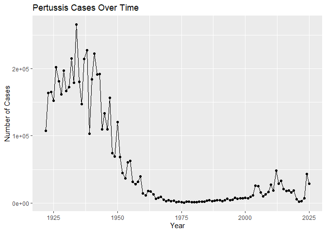
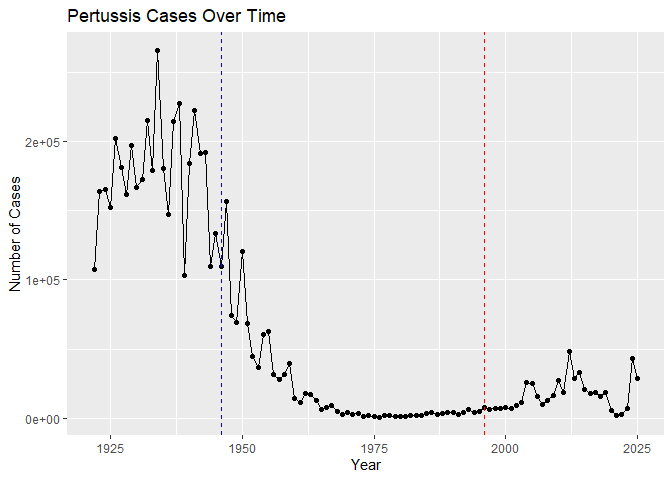
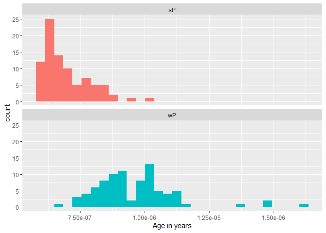
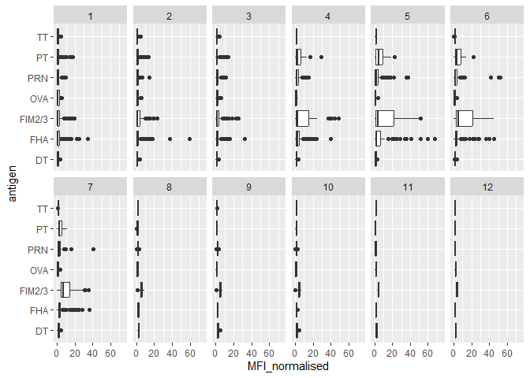
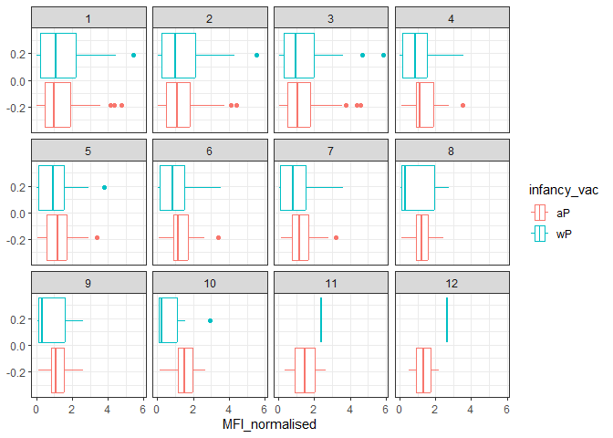
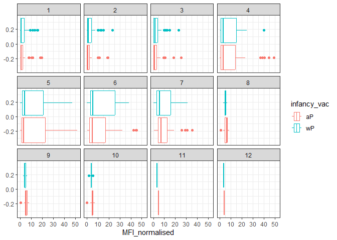
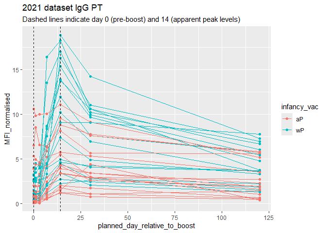
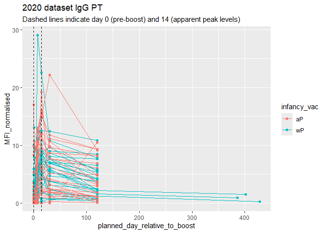

# Lab 18: Investigating Pertussis Resurgence
Alexia (A17297003)

- [Background](#background)
- [Investigating pertussis cases by
  year](#investigating-pertussis-cases-by-year)
- [A tale of two vaccines (wP and
  aP)](#a-tale-of-two-vaccines-wp-and-ap)
- [Exploring CMI-PB Data](#exploring-cmi-pb-data)
- [Side Note: Working with Dates](#side-note-working-with-dates)
- [Joining Multiple Tables](#joining-multiple-tables)
- [Examine IgG Ab titer levels](#examine-igg-ab-titer-levels)
- [Obtaining CMI-PB RNASeq data](#obtaining-cmi-pb-rnaseq-data)

## Background

Pertussis (more commonly known as whooping cough) is a highly contagious
respiratory disease caused by the bacterium Bordetella pertussis.

We will be using web-scraping, JSON based APIs and advanced dplyr and
ggplot to investigate brand new datasets associated with pertussis cases
and longitudinal RNA-Seq on the immune response to distinct vaccination
strategies.

## Investigating pertussis cases by year

The United States Centers for Disease Control and Prevention (CDC) has
been compiling reported pertussis case numbers since 1922 in their
National Notifiable Diseases Surveillance System (NNDSS). We can view
this data on the CDC website here:
https://www.cdc.gov/pertussis/surv-reporting/cases-by-year.html

``` r
read.csv("Pertussis Cases 1922-2025.csv")
```

        Year Number.of.Reported.Pertussis.Cases Data.Status
    1   1922                            107,473   Finalized
    2   1923                            164,191   Finalized
    3   1924                            165,418   Finalized
    4   1925                            152,003   Finalized
    5   1926                            202,210   Finalized
    6   1927                            181,411   Finalized
    7   1928                            161,799   Finalized
    8   1929                            197,371   Finalized
    9   1930                            166,914   Finalized
    10  1931                            172,559   Finalized
    11  1932                            215,343   Finalized
    12  1933                            179,135   Finalized
    13  1934                            265,269   Finalized
    14  1935                            180,518   Finalized
    15  1936                            147,237   Finalized
    16  1937                            214,652   Finalized
    17  1938                            227,319   Finalized
    18  1939                            103,188   Finalized
    19  1940                            183,866   Finalized
    20  1941                            222,202   Finalized
    21  1942                            191,383   Finalized
    22  1943                            191,890   Finalized
    23  1944                            109,873   Finalized
    24  1945                            133,792   Finalized
    25  1946                            109,860   Finalized
    26  1947                            156,517   Finalized
    27  1948                             74,715   Finalized
    28  1949                             69,479   Finalized
    29  1950                            120,718   Finalized
    30  1951                             68,687   Finalized
    31  1952                             45,030   Finalized
    32  1953                             37,129   Finalized
    33  1954                             60,886   Finalized
    34  1955                             62,786   Finalized
    35  1956                             31,732   Finalized
    36  1957                             28,295   Finalized
    37  1958                             32,148   Finalized
    38  1959                             40,005   Finalized
    39  1960                             14,809   Finalized
    40  1961                             11,468   Finalized
    41  1962                             17,749   Finalized
    42  1963                             17,135   Finalized
    43  1964                             13,005   Finalized
    44  1965                              6,799   Finalized
    45  1966                              7,717   Finalized
    46  1967                              9,718   Finalized
    47  1968                              4,810   Finalized
    48  1969                              3,285   Finalized
    49  1970                              4,249   Finalized
    50  1971                              3,036   Finalized
    51  1972                              3,287   Finalized
    52  1973                              1,759   Finalized
    53  1974                              2,402   Finalized
    54  1975                              1,738   Finalized
    55  1976                              1,010   Finalized
    56  1977                              2,177   Finalized
    57  1978                              2,063   Finalized
    58  1979                              1,623   Finalized
    59  1980                              1,730   Finalized
    60  1981                              1,248   Finalized
    61  1982                              1,895   Finalized
    62  1983                              2,463   Finalized
    63  1984                              2,276   Finalized
    64  1985                              3,589   Finalized
    65  1986                              4,195   Finalized
    66  1987                              2,823   Finalized
    67  1988                              3,450   Finalized
    68  1989                              4,157   Finalized
    69  1990                              4,570   Finalized
    70  1991                              2,719   Finalized
    71  1992                              4,083   Finalized
    72  1993                              6,586   Finalized
    73  1994                              4,617   Finalized
    74  1995                              5,137   Finalized
    75  1996                              7,796   Finalized
    76  1997                              6,564   Finalized
    77  1998                              7,405   Finalized
    78  1999                              7,298   Finalized
    79  2000                              7,867   Finalized
    80  2001                              7,580   Finalized
    81  2002                              9,771   Finalized
    82  2003                             11,647   Finalized
    83  2004                             25,827   Finalized
    84  2005                             25,616   Finalized
    85  2006                             15,632   Finalized
    86  2007                             10,454   Finalized
    87  2008                             13,278   Finalized
    88  2009                             16,858   Finalized
    89  2010                             27,550   Finalized
    90  2011                             18,719   Finalized
    91  2012                             48,277   Finalized
    92  2013                             28,639   Finalized
    93  2014                             32,971   Finalized
    94  2015                             20,762   Finalized
    95  2016                             17,972   Finalized
    96  2017                             18,975   Finalized
    97  2018                             15,609   Finalized
    98  2019                             18,617   Finalized
    99  2020                              6,124   Finalized
    100 2021                              2,116   Finalized
    101 2022                              3,044   Finalized
    102 2023                              7,063   Finalized
    103 2024                             43,321 Provisional
    104 2025                             28,783 Provisional

``` r
cdc <- read.csv("Pertussis Cases 1922-2025.csv")
```

``` r
cdc$Number.of.Reported.Pertussis.Cases <- as.numeric(gsub("," , "" , cdc$Number.of.Reported.Pertussis.Cases))
```

> Q1. Assign the CDC pertussis case number data to a data frame called
> cdc and use ggplot to make a plot of cases numbers over time.

``` r
library(ggplot2)
```

``` r
ggplot(cdc) +
  aes(x = Year, y = Number.of.Reported.Pertussis.Cases) +
  geom_point() +
  geom_line() +
  labs(
    x = "Year",
    y = "Number of Cases",
    title = "Pertussis Cases Over Time"
  )
```



## A tale of two vaccines (wP and aP)

Two types of pertussis vaccines have been developed: whole-cell
pertussis (wP) and acellular pertussis (aP). The first vaccines were
composed of ‘whole cell’ (wP) inactivated bacteria. The latter aP
vaccines use purified antigens of the bacteria.

These aP vaccines were developed to have less side effects than the
older wP vaccines and are now the only form administered in the United
States.

> Q2. Using the ggplot `geom_vline()` function add lines to your
> previous plot for the 1946 introduction of the wP vaccine and the 1996
> switch to aP vaccine. What do you notice?

``` r
ggplot(cdc) +
  aes(x = Year, y = Number.of.Reported.Pertussis.Cases) +
  geom_point() +
  geom_line() +
  geom_vline(xintercept = 1946,linetype = "dashed",color = "blue") +
  geom_vline(xintercept = 1996,linetype = "dashed",color = "red") +
  labs(x = "Year", y = "Number of Cases",title = "Pertussis Cases Over Time"
  )
```



> Q3. Describe what happened after the introduction of the aP vaccine?
> Do you have a possible explanation for the observed trend?

After the introduction of the aP vaccine (red dashed line) the number of
cases appear to be rising once more. Some possible explanations for this
trend could be due to the rise in hesitation of getting vaccinated,
bacterial evolution, and difference in immunity to the vaccine in
infants and young adults.

## Exploring CMI-PB Data

Why is this vaccine-preventable disease on the upswing? To answer this
question we need to investigate the mechanisms underlying waning
protection against pertussis. This requires evaluation of
pertussis-specific immune responses over time in wP and aP vaccinated
individuals.

``` r
# Allows us to read, write and process JSON data
library(jsonlite)
```

Let’s now read the main subject database table from the CMI-PB API:

``` r
subject <- read_json("https://www.cmi-pb.org/api/subject", simplifyVector = TRUE) 
```

**Key-Point**: The subject table provides metadata about each individual
in the study group. For example, their infancy vaccination type,
biological sex, year of birth, time of boost etc.

``` r
head(subject, 3)
```

      subject_id infancy_vac biological_sex              ethnicity  race
    1          1          wP         Female Not Hispanic or Latino White
    2          2          wP         Female Not Hispanic or Latino White
    3          3          wP         Female                Unknown White
      year_of_birth date_of_boost      dataset
    1    1986-01-01    2016-09-12 2020_dataset
    2    1968-01-01    2019-01-28 2020_dataset
    3    1983-01-01    2016-10-10 2020_dataset

> Q4. How many aP and wP infancy vaccinated subjects are in the dataset?

``` r
table(subject$infancy_vac)
```


    aP wP 
    87 85 

There are 87 aP infancy vaccinated subjects and 85 wP infancy vaccinated
subjects in the dataset.

> Q5. How many Male and Female subjects/patients are in the dataset?

``` r
table(subject$biological_sex)
```


    Female   Male 
       112     60 

There are 112 female and 60 male subjects/patients in the dataset.

> Q6. What is the breakdown of race and biological sex (e.g. number of
> Asian females, White males etc…)?

``` r
table(subject$race, subject$biological_sex)
```

                                               
                                                Female Male
      American Indian/Alaska Native                  0    1
      Asian                                         32   12
      Black or African American                      2    3
      More Than One Race                            15    4
      Native Hawaiian or Other Pacific Islander      1    1
      Unknown or Not Reported                       14    7
      White                                         48   32

## Side Note: Working with Dates

Dates and times can be annoying to work with at the best of times.
However, in R we have the excellent lubridate package, which can make
life allot easier.

``` r
library(lubridate)
```


    Attaching package: 'lubridate'

    The following objects are masked from 'package:base':

        date, intersect, setdiff, union

Convert date into proper date format:

``` r
subject$year_of_birth <- ymd(subject$year_of_birth)
subject$date_of_boost <- ymd(subject$date_of_boost)
```

Create age in years:

``` r
subject$age <- time_length(interval(subject$year_of_birth, subject$date_of_boost), "years")
```

> Q7. Determine (i) the average age of wP individuals, (ii) the average
> age of aP individuals; and (iii) are they significantly different?

The average age of wP individuals:

``` r
mean(subject$age[subject$infancy_vac == "wP"], na.rm = TRUE)
```

    [1] 30.3625

The average age of aP individuals:

``` r
mean(subject$age[subject$infancy_vac == "aP"], na.rm = TRUE)
```

    [1] 21.91779

Are they significantly different? Let’s perform a t-test that compares
the mean ages of the two groups (wP / aP):

``` r
t.test(age ~ infancy_vac, data = subject)
```


        Welch Two Sample t-test

    data:  age by infancy_vac
    t = -13.31, df = 128.26, p-value < 2.2e-16
    alternative hypothesis: true difference in means between group aP and group wP is not equal to 0
    95 percent confidence interval:
     -9.700130 -7.189298
    sample estimates:
    mean in group aP mean in group wP 
            21.91779         30.36250 

A p-value of 2.2e-16 reveals that the average age between both groups IS
statistically significant.

> Q8. Determine the age of all individuals at time of boost?

``` r
int <- ymd(subject$date_of_boost) - ymd(subject$year_of_birth)
age_at_boost <- time_length(int, "year")
head(age_at_boost)
```

    [1] 30.69678 51.07461 33.77413 28.65982 25.65914 28.77481

> Q9. With the help of a faceted boxplot or histogram (see below), do
> you think these two groups are significantly different?

``` r
ggplot(subject) +
  aes(time_length(age, "year"),
      fill=as.factor(infancy_vac)) +
  geom_histogram(show.legend=FALSE) +
  facet_wrap(vars(infancy_vac), nrow=2) +
  xlab("Age in years")
```

    `stat_bin()` using `bins = 30`. Pick better value `binwidth`.



Yes, the histograms above clearly show that the two groups are
significantly different. While the age for aP appears to be more skewed
to the left, the age for wP is more skewed to the right. aP has more
younger subjects whereas the subjects for wP are much older.

## Joining Multiple Tables

We will read the specimen and ab_titer tables into R and store the data
as specimen and titer named data frames:

``` r
specimen <- read_json("https://www.cmi-pb.org/api/specimen", simplifyVector = TRUE) 
titer <- read_json("https://www.cmi-pb.org/api/plasma_ab_titer", simplifyVector = TRUE) 
```

To know whether a given specimen_id comes from an aP or wP individual we
need to link (a.k.a. “join” or merge) our specimen and subject data
frames.The excellent dplyr package has a family of `join()` functions
that can help us with this common task:

> Q9. Complete the code to join specimen and subject tables to make a
> new merged data frame containing all specimen records along with their
> associated subject details:

``` r
library(dplyr)
```


    Attaching package: 'dplyr'

    The following objects are masked from 'package:stats':

        filter, lag

    The following objects are masked from 'package:base':

        intersect, setdiff, setequal, union

``` r
meta <- left_join(specimen, subject)
```

    Joining with `by = join_by(subject_id)`

``` r
dim(meta)
```

    [1] 1503   14

``` r
head(meta)
```

      specimen_id subject_id actual_day_relative_to_boost
    1           1          1                           -3
    2           2          1                            1
    3           3          1                            3
    4           4          1                            7
    5           5          1                           11
    6           6          1                           32
      planned_day_relative_to_boost specimen_type visit infancy_vac biological_sex
    1                             0         Blood     1          wP         Female
    2                             1         Blood     2          wP         Female
    3                             3         Blood     3          wP         Female
    4                             7         Blood     4          wP         Female
    5                            14         Blood     5          wP         Female
    6                            30         Blood     6          wP         Female
                   ethnicity  race year_of_birth date_of_boost      dataset
    1 Not Hispanic or Latino White    1986-01-01    2016-09-12 2020_dataset
    2 Not Hispanic or Latino White    1986-01-01    2016-09-12 2020_dataset
    3 Not Hispanic or Latino White    1986-01-01    2016-09-12 2020_dataset
    4 Not Hispanic or Latino White    1986-01-01    2016-09-12 2020_dataset
    5 Not Hispanic or Latino White    1986-01-01    2016-09-12 2020_dataset
    6 Not Hispanic or Latino White    1986-01-01    2016-09-12 2020_dataset
           age
    1 30.69672
    2 30.69672
    3 30.69672
    4 30.69672
    5 30.69672
    6 30.69672

> Q10. Now using the same procedure join meta with titer data so we can
> further analyze this data in terms of time of visit aP/wP, male/female
> etc.

``` r
abdata <- inner_join(titer, meta)
```

    Joining with `by = join_by(specimen_id)`

``` r
dim(abdata)
```

    [1] 52576    21

> Q11. How many specimens (i.e. entries in abdata) do we have for each
> isotype?

``` r
table(abdata$isotype)
```


      IgE   IgG  IgG1  IgG2  IgG3  IgG4 
     6698  5389 10117 10124 10124 10124 

> Q12. What are the different \$dataset values in abdata and what do you
> notice about the number of rows for the most “recent” dataset?

``` r
table(abdata$dataset)
```


    2020_dataset 2021_dataset 2022_dataset 2023_dataset 
           31520         8085         7301         5670 

The different \$dataset values in abdata are as follows: 31520, 8085,
7301, and 5670. The most “recent” dataset shows a significant decrease
compared to the value of rows under the older dataset.

## Examine IgG Ab titer levels

Now using our joined/merged/linked abdata dataset we will `filter()` for
IgG isotype:

``` r
igg <- abdata %>% filter(isotype == "IgG")
head(igg)
```

      specimen_id isotype is_antigen_specific antigen        MFI MFI_normalised
    1           1     IgG                TRUE      PT   68.56614       3.736992
    2           1     IgG                TRUE     PRN  332.12718       2.602350
    3           1     IgG                TRUE     FHA 1887.12263      34.050956
    4          19     IgG                TRUE      PT   20.11607       1.096366
    5          19     IgG                TRUE     PRN  976.67419       7.652635
    6          19     IgG                TRUE     FHA   60.76626       1.096457
       unit lower_limit_of_detection subject_id actual_day_relative_to_boost
    1 IU/ML                 0.530000          1                           -3
    2 IU/ML                 6.205949          1                           -3
    3 IU/ML                 4.679535          1                           -3
    4 IU/ML                 0.530000          3                           -3
    5 IU/ML                 6.205949          3                           -3
    6 IU/ML                 4.679535          3                           -3
      planned_day_relative_to_boost specimen_type visit infancy_vac biological_sex
    1                             0         Blood     1          wP         Female
    2                             0         Blood     1          wP         Female
    3                             0         Blood     1          wP         Female
    4                             0         Blood     1          wP         Female
    5                             0         Blood     1          wP         Female
    6                             0         Blood     1          wP         Female
                   ethnicity  race year_of_birth date_of_boost      dataset
    1 Not Hispanic or Latino White    1986-01-01    2016-09-12 2020_dataset
    2 Not Hispanic or Latino White    1986-01-01    2016-09-12 2020_dataset
    3 Not Hispanic or Latino White    1986-01-01    2016-09-12 2020_dataset
    4                Unknown White    1983-01-01    2016-10-10 2020_dataset
    5                Unknown White    1983-01-01    2016-10-10 2020_dataset
    6                Unknown White    1983-01-01    2016-10-10 2020_dataset
           age
    1 30.69672
    2 30.69672
    3 30.69672
    4 33.77322
    5 33.77322
    6 33.77322

> Q13. Make a summary boxplot of Ab titer levels (MFI) for all antigens:

``` r
ggplot(igg) +
  aes(MFI_normalised, antigen) +
  geom_boxplot() + 
    xlim(0,75) +
  facet_wrap(vars(visit), nrow=2)
```



> Q14. What antigens show differences in the level of IgG antibody
> titers recognizing them over time? Why these and not others?

The antigens that show differences in the level of IgG antibody titers
recognizing them over time are FHA and FIM2/2. This makes sense as both
of these antigens play crucial roles in bacteria adhesion, facilitating
the adhesion of bacteria to host cells. The other antigens don’t show
much of a difference as they don’t have a similar role to FHA and
FIM2/2. For example, the antigen TT doesn’t show a difference because it
is a tumor associated antigen playing a role in immune response rather
than bacteria adhesion.

We can attempt to examine differences between wP and aP here by setting
color and/or facet values of the plot to include infancy_vac status.
However these plots tend to be rather busy and thus hard to interpret
easily.

> Q15. Filter to pull out only two specific antigens for analysis and
> create a boxplot for each.

``` r
filter(igg, antigen=="OVA") %>%
  ggplot() +
  aes(MFI_normalised, col=infancy_vac) +
  geom_boxplot(show.legend = TRUE) +
  facet_wrap(vars(visit)) +
  theme_bw()
```



``` r
filter(igg, antigen=="FIM2/3") %>%
  ggplot() +
  aes(MFI_normalised, col=infancy_vac) +
  geom_boxplot(show.legend = TRUE) +
  facet_wrap(vars(visit)) +
  theme_bw()
```



> Q16. What do you notice about these two antigens time courses and the
> PT data in particular?

Whereas OVA remains stable FIM2/3 does not and drastically decreases
over time. One thing to note about the PT data is that through plots 4-7
for FIM2/3 there is a clear stable increase before a sudden decrease, a
pattern not found for OVA.

> Q17. Do you see any clear difference in aP vs. wP responses?

aP and wP responses appear to be somewhat the same for FIM2/3 with aP
appearing to be slightly quicker in visit 8. There is a clearer
difference in OVA where aP shows a much quicker response than wP.

Lets finish this section by looking at the 2021 dataset IgG PT antigen
levels time-course:

``` r
abdata.21 <- abdata %>% filter(dataset == "2021_dataset")

abdata.21 %>% 
  filter(isotype == "IgG",  antigen == "PT") %>%
  ggplot() +
    aes(x=planned_day_relative_to_boost,
        y=MFI_normalised,
        col=infancy_vac,
        group=subject_id) +
    geom_point() +
    geom_line() +
    geom_vline(xintercept=0, linetype="dashed") +
    geom_vline(xintercept=14, linetype="dashed") +
  labs(title="2021 dataset IgG PT",
       subtitle = "Dashed lines indicate day 0 (pre-boost) and 14 (apparent peak levels)")
```



> Q18. Does this trend look similar for the 2020 dataset?

``` r
abdata.20 <- abdata %>% filter(dataset == "2020_dataset")

abdata.20 %>% 
  filter(isotype == "IgG",  antigen == "PT") %>%
  ggplot() +
    aes(x=planned_day_relative_to_boost,
        y=MFI_normalised,
        col=infancy_vac,
        group=subject_id) +
    geom_point() +
    geom_line() +
    geom_vline(xintercept=0, linetype="dashed") +
    geom_vline(xintercept=14, linetype="dashed") +
  labs(title="2020 dataset IgG PT",
       subtitle = "Dashed lines indicate day 0 (pre-boost) and 14 (apparent peak levels)")
```



This trend does not appear to look similar for the 2020 dataset.

## Obtaining CMI-PB RNASeq data

Let’s read available RNA-Seq data for the gene IGHG1 into R and
investigate the time course of it’s gene expression values.

``` r
url <- "https://www.cmi-pb.org/api/v2/rnaseq?versioned_ensembl_gene_id=eq.ENSG00000211896.7"

rna <- read_json(url, simplifyVector = TRUE) 
```

To facilitate further analysis we need to “join” the rna expression data
with our metadata meta, which is itself a join of sample and specimen
data. This will allow us to look at this genes TPM expression values
over aP/wP status and at different visits (i.e. times):

``` r
#meta <- inner_join(specimen, subject)
ssrna <- inner_join(rna, meta)
```

    Joining with `by = join_by(specimen_id)`

> Q19. Make a plot of the time course of gene expression for IGHG1 gene.

``` r
ggplot(ssrna) +
  aes(x = visit, y = tpm, group=subject_id) +
  geom_point() +
  geom_line(alpha=0.2)
```


> Q20. What do you notice about the expression of this gene (i.e. when
> is it at it’s maximum level)?

The gene is at it’s maximum level during visit 4 and visit 8.

> Q21. Does this pattern in time match the trend of antibody titer data?
> If not, why not?

Yes, this pattern in time matches the trend of antibody titer data as
the highest levels of antigen are during visits 4 and 8.
